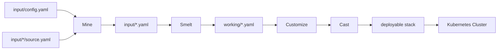

# Cluster-Forge

**A helper tool that sets up all essential platform tools to prepare a Kubernetes cluster for running applications.**

## Overview

**Cluster-Forge** is a tool designed to bundle various third-party, community, and in-house components into a single, streamlined stack that can be deployed in Kubernetes clusters. By automating the deployment process, Cluster-Forge simplifies the creation of consistent, ready-to-use clusters.

This tool is ideal for scenarios such as:

- **Ephemeral test clusters** - Create temporary environments quickly
- **CI/CD pipeline clusters** - Ensure consistent testing environments
- **Multiple production clusters** - Manage a fleet of clusters efficiently
- **Reproducible environments** - Ensure consistency across deployments

## 🚀 Quick Start

```bash
# Using a pre-built stack (recommended for first-time users)
# 1. Download a release package
# 2. Extract the package
# 3. Deploy to your Kubernetes cluster
./deploy.sh

# Building your own stack with devbox
devbox shell
go run . forge  # Runs both smelt and cast, creating an ephemeral image
```

## 📋 Workflow

Cluster-Forge operates through a sequence of well-defined steps:

1. **Mine** - Process input configuration to generate normalized YAML in the input directory
2. **Smelt** - Process input configuration to generate normalized YAML in the working directory
3. **Customize** (optional) - Edit files in the working directory
4. **Cast** - Compile components into a deployable stack image
5. **Forge** - Combined operation that runs both smelt and cast, creating an ephemeral image



## 🛠️ Available Components

Cluster-Forge supports a wide range of components that can be imported into your cluster:

### Core Infrastructure
- **Longhorn** - Cloud native distributed storage solution
- **MetalLB** - Load-balancer implementation for bare metal clusters
- **CertManager** - Certificate management controller
- **External Secrets** - Kubernetes operator for external secrets management
- **Gateway API** - Next generation Kubernetes Ingress
- **KGateway** - Kubernetes Gateway implementation

### Monitoring & Observability
- **Grafana** - Metrics visualization and dashboards
- **Prometheus** - Monitoring system and time series database
- **Grafana Loki** - Log aggregation system
- **Grafana Mimir** - Highly available metrics backend
- **Promtail** - Log collector for Loki
- **OpenObserve** - Observability platform
- **OpenTelemetry Operator** - Telemetry collection and management
- **OTEL-LGTM Stack** - OpenTelemetry with Loki, Grafana, Tempo, and Mimir
- **Kube-Prometheus-Stack** - End-to-end Kubernetes cluster monitoring

### Database & Storage
- **MinIO Operator** - Kubernetes operator for MinIO object storage
- **MinIO Tenant** - Multi-tenant MinIO deployment
- **CNPG Operator** - Cloud Native PostgreSQL operator
- **PSMDB Operator** - Percona Server for MongoDB operator
- **Redis** - In-memory data structure store

### GPU Support
- **AMD GPU Operator** - GPU operator for AMD Instinct GPUs
- **AMD Device Config** - Device configuration for AMD GPUs

### ML & Data Services
- **KubeRay Operator** - Kubernetes operator for Ray
- **Kueue** - Job queue controller for Kubernetes
- **AppWrapper** - Application wrapper for job scheduling
- **Kaiwo** - ML workflow management

### Security & Management
- **Kyverno** - Kubernetes policy engine
- **Trivy** - Vulnerability scanner
- **1Password Secret Store** - 1Password integration for secrets management
- **K8s Cluster Secret Store** - Kubernetes native secret store

## 💾 Storage Classes

Storage classes are provided by default with Longhorn. These can be customized as needed.

| Purpose | StorageClass | Access Mode | Locality |
|---------|--------------|-------------|----------|
| GPU Job | mlstorage | RWO | LOCAL/remote |
| GPU Job | default | RWO | LOCAL/remote |
| Advanced usage | direct | RWO | LOCAL |
| Multi-container | multinode | RWX | ANYWHERE |

## 🛠️ Development Setup

### Prerequisites

- **[Devbox](docs/DEVBOX.md)** for development environment
- **Docker** with multi-architecture support (buildx)
- **Golang** v1.23+
- **kubectl**
- **Helm**

Setting up the development environment:

```bash
# Install devbox
curl -fsSL https://get.jetpack.io/devbox | bash

# Start devbox shell
devbox shell
```

### Common Commands

```bash
# Building
go build
just build

# Running commands
go run . mine
go run . smelt
go run . cast
go run . forge

# With debug logging
LOG_LEVEL=debug go run . smelt
LOG_LEVEL=debug go run . cast
LOG_LEVEL=debug go run . forge

# Shorthand with justfile
just debug-smelt
just debug-cast
just debug-forge

# Testing
go test ./...

# Cleanup
devbox run clean
just clean-all

# Reset Kind cluster (for testing)
devbox run resetKind
```

## 📄 Configuration

The project uses YAML configuration files:

- Main configuration: `input/config.yaml`
- Default options: `options/defaults.yaml`
- Release configurations: `input/config-*.yaml`
- Source configurations: `input/*/source.yaml`

## 🗺️ Development Roadmap

Cluster-Forge development is managed using [TaskMaster AI](https://github.com/taskmaster-ai/taskmaster-ai) for structured project management. The complete roadmap and task details can be found in [PRD.md](PRD.md).

### Current Development Priorities

#### 🔴 High Priority
1. **Enhanced Testing Framework** - Comprehensive unit, integration, E2E, and performance testing
2. **Improved Error Handling** - Standardized error types, recovery mechanisms, troubleshooting guides
3. **Configuration Validation** - Schema validation, dependency conflict detection, compatibility checks

#### 🟡 Medium Priority
4. **Performance Optimization** - Parallel processing, incremental builds, caching, resource monitoring
5. **Enhanced Customization** - Templating system, environment injection, plugin architecture
6. **Observability Improvements** - Logging, metrics, deployment tracking, health monitoring, audit trails

#### 🟢 Low Priority
7. **Additional Integrations** - Multiple Helm repos, CI/CD platforms, GitOps tools, cloud optimizations
8. **Documentation & Examples** - Configuration guides, best practices, tutorials, contribution guidelines

### Task Management

For contributors and maintainers, use TaskMaster to track development progress:

```bash
# View all tasks
tm get-tasks

# Get next task to work on
tm next-task

# Update task status
tm set-task-status <task-id> <status>
```

## 🐞 Known Issues

Cluster-Forge is still a work in progress with the following known issues:

1. **Terminal Line Handling**: Errors occurring alongside the progress spinner may cause terminal formatting issues. To restore the terminal, run:  
   ```sh
   reset
   ```

## 📝 License

Cluster-Forge is licensed under the Apache License, Version 2.0. See the [LICENSE](LICENSE) file for details.

---

<div align="center">
  <p>Give Cluster-Forge a try and let us know how it works for you!</p>
</div>