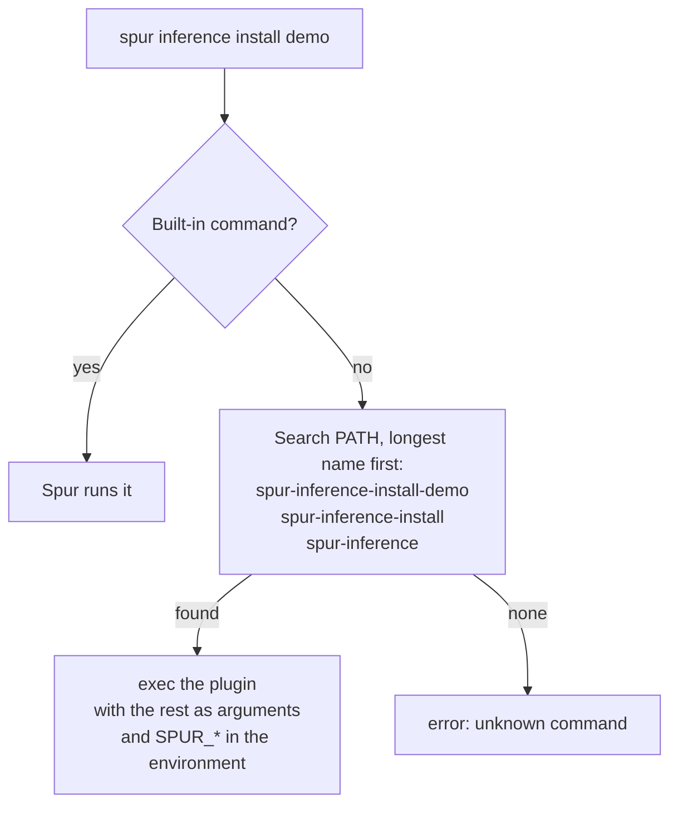
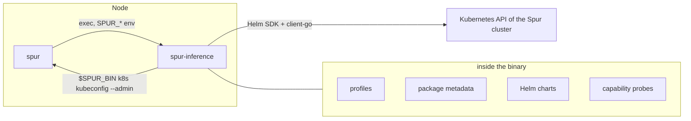

# Spur CLI plugins, with `spur inference` as the first one

| Item | Value |
|---|---|
| Status | Implemented and tested. Not merged to the Spur main branch. |
| Author | Marc Dillon, Petrus Repo, AMD Silo AI, Enterprise AI |
| Date | 2026-09-16 |
| Tickets | EAI-8560 (byok and `spur-inference`) |
| Approval | Open. This document goes to a second team for review. |
| Audience | Teams that build tools on top of Spur, and teams that ship a product on a Spur cluster. |

## Objective

Spur is an open-source job scheduler with a Kubernetes cluster of its own. Give
Spur a plugin mechanism in the style of `kubectl`: when `spur <name>` is not a
built-in command, Spur runs the executable `spur-<name>` from `PATH`. A team
then adds a command to the Spur command line without a change to Spur, without
a Spur release, and without its product names in a public repository.

`spur inference` is the first plugin. It installs the selected AMD Enterprise AI
Reference Stack on a Spur cluster with one command, and it holds every Helm
chart inside its own binary.

## Background

Spur is a scheduler. It runs batch jobs, and `spur k8s up` gives the same nodes
a Kubernetes cluster. An operator who has a Spur cluster and wants the AMD
Enterprise AI Reference Stack on it had to leave the Spur command line, find another
installer, and give that installer a kubeconfig.

The obvious answer, a built-in `spur inference` command, has two problems. Spur is
public and vendor-neutral; the AMD product names, the Helm dependencies and the
install order of the AI stack do not belong in it. And the release cadences
differ: a new profile of the AI stack would need a new Spur release.

This is the same problem `kubectl` solved with plugins in 2017 and `git` solved
with `git-<name>` before that. The mechanism is known to work, and an operator
who knows `kubectl krew` recognizes it at once.

Two decisions came out of the work, and this document records them:

1. Spur gets a generic plugin mechanism. The product code stays outside Spur.
2. The plugin `spur-inference` is one Go binary with the charts embedded in it, not
   a script that needs tools on the node.

## Goals

- An operator installs the Enterprise AI Reference Stack with one command on a
  node that has only Spur, and reads the state of that installation with the same
  command line.
- A product team ships a new profile or a chart fix without a Spur release, and
  a Spur release never waits for a product team.
- Spur stays vendor-neutral: no product name, no Helm dependency, no AI stack
  knowledge in the Spur repository.
- The install works on a node that cannot reach a package manager, a git
  server, or a chart registry. The only network need is the container image
  pull of the cluster itself.
- An operator can see what a profile put on the cluster, and can remove it
  again without damage to what another profile owns.

## Non-goals

- A plugin registry or an `install` command in the style of `krew`. A plugin is
  a file on `PATH`; how it arrives there is out of scope. This needs a signing
  and versioning policy first.
- A plugin API, a metadata format, or a manifest. Spur reads no metadata from a
  plugin.
- An identity or a token in the plugin environment. See Trust boundary.
- A replacement for GitOps. The plugin installs a stack; it does not keep the
  stack in step with a git repository.
- Support for a Kubernetes cluster that Spur does not own. The plugin asks Spur
  for the kubeconfig.

## Design

### The plugin mechanism in Spur

When `spur <name> ...` matches no built-in command, Spur searches `PATH` for
`spur-<name>` and replaces its own process with it.



Four rules make the behaviour predictable:

- **A built-in command always wins.** A `spur-queue` file on `PATH` never runs.
  `spur plugin list` marks it as a shadow, so the operator sees why.
- **The longest match wins**, so one plugin can own a whole command tree.
- **Spur replaces its own process**, so the exit code and the signals belong to
  the plugin.
- **`spur plugin list` and `spur help` show what is on `PATH`**, so a plugin is
  discoverable without documentation.

### Trust boundary

Spur exports five variables and nothing else:

| Variable | Value |
|---|---|
| `SPUR_CONTROLLER_ADDR` | Controller endpoints |
| `SPUR_CONF` | Path of the configuration file in use |
| `SPUR_BIN` | Absolute path of the running `spur` binary |
| `SPUR_VERSION` | Version of that binary |
| `SPUR_PLUGIN_NAME` | The resolved name, for example `inference` |

**No user identity and no token go to a plugin.** A plugin that needs cluster
access asks Spur for it, for example with `$SPUR_BIN k8s kubeconfig --admin`,
which applies the authorization rules of Spur at that moment. A plugin is an
executable that the operator installed and that runs with the rights of the
operator; the mechanism adds no rights and hands over no credential. This is
the one-way door of the design: a token in the environment would be impossible
to take back later.

### `spur inference`, the first plugin

`spur-inference` is one Go binary. `go:embed` puts the profiles, the package
metadata, the capability list and every Helm chart inside it. Helm itself is
inside it too, as the Helm Go library, not as the `helm` command: the binary
installs, upgrades and removes releases in its own process, and talks to the
cluster with client-go. The node therefore needs no `helm`, `kubectl`, `yq`,
`jq` or `git`, and no access to a git server or a chart registry. The binary
runs two external commands, both of them `spur`: one asks for the kubeconfig,
the other reads the resources of the node.



A **package** is one Helm chart plus the metadata that says which namespace it
goes in, which capabilities it gives (`provides`) and which it needs
(`requires`). A **profile** is an ordered list of packages with the values that
bind them together, and it can extend another profile. Today there are 21
packages and 4 profiles, from an inference stack on AMD Instinct GPUs or on
CPU to a full demo with an OIDC issuer, a database and the workbench user
interface. The default profile holds the GPU operator; `--no-gpu` selects the
`-cpu` twin of a profile.

The command surface is small on purpose:

```
spur inference list
spur inference validate  [<profile>] [--var name=value]... [--no-gpu]
spur inference install   [<profile>] [--var name=value]... [--smoke-test] [--no-gpu]
spur inference status
spur inference uninstall [<profile>] [--keep-data] [--yes]
spur inference version
```

Four behaviours are worth naming, because each answers a failure we saw on a
real cluster:

- **An install record.** A ConfigMap in the cluster holds one entry per
  installed profile: the version of the binary, the time, the variables and the
  packages that went on. An install that stops part way writes a partial record
  and says which command removes it. Without the record, an operator cannot
  know what a profile owns.
- **Capability probes.** The binary asks the cluster what is already there
  instead of trusting the record, so an install on a cluster that another tool
  touched still does the right thing.
- **A removal that respects other profiles.** An uninstall keeps every release,
  namespace and custom resource definition that a package of another installed
  profile owns, and it takes finalizers off custom resources before it removes
  their definition, while the controller still runs. It shows what goes and
  asks before the first removal; a script gives `--yes`.
- **A failure that names its cause.** When a package does not become ready, the
  binary names the pod, its reason and its message, instead of the Helm
  timeout.

The binary is about 106 MB, of which the embedded assets are about 2.6 MB. It
also runs directly, without `spur`, with a `--kubeconfig` path.

### Measured behaviour

On a two-node Kubernetes cluster that Spur made:

| Step | Time |
|---|---|
| Install the CPU inference profile | 2 min 10 s |
| Install it with the smoke test, which deploys and serves a dummy model | 3 min 04 s |
| Remove the profile, with no namespace and no definition left | 54 s |
| Remove one profile while a second one stays | 20 s, the nine shared packages stay |

On a node with 8 AMD Instinct GPUs, the same binary installed the GPU profile,
gave the workload `amd.com/gpu: 8`, and passed the smoke test in 3 min 24 s.

## Alternatives

- **A built-in `spur inference` subcommand.** Rejected: it puts product names and
  Helm dependencies into a public scheduler, and every new profile then needs a
  Spur release.
- **A generic `spur install <chart>` that wraps Helm.** Rejected: the install
  order, the capability checks and the install record are product logic. In
  Spur they would be a second, weaker Helm.
- **A shell script plugin with the charts beside it.** This is what we had
  first. It needed `helm`, `kubectl`, `yq` v4, `jq` and `git` on the node, and
  it cloned the chart repository at run time. The first minutes of an install
  became a tool install, and a node behind a proxy could do neither.
- **A container image with the tools inside it.** Rejected: it needs a
  container runtime that can reach the API server, and the operator then debugs
  a container instead of a command.
- **A plugin that pulls its charts at run time.** Rejected: it keeps the git
  and registry dependency that the binary removes.

## Consequences

- A chart change reaches an operator only after a new plugin binary is built.
  The release of the plugin is therefore a release of the product repository,
  not of Spur.
- There is no `--ref` or `--version` flag for the content: an upgrade is an
  install from a newer binary.
- The build of the binary needs the `helm` command line and the network once,
  to resolve the chart dependencies into the files that go inside the binary.
  At install time no dependecies are needed.
- Spur and the plugin are tested and released on their own timelines. The Spur
  side is about 300 lines and has no product dependency.

## Open issues

1. **Plugin distribution.** Problem: a plugin arrives on `PATH` by hand today.
   Options: leave it to the packaging of each product; add `spur plugin
   install` that pulls a signed release; publish plugins in an index like
   `krew`. Next step: a decision on signing and versioning before any download
   code is written. This needs a decision from the reviewing team.
2. **A plugin that wants the identity of the caller.** Problem: the environment
   carries no identity, so a plugin that must act as the user asks Spur again
   and gets the rights of the process, not of the user. Options: keep it as it
   is; add a short-lived scoped token that Spur mints for a named plugin. Next
   step: decide whether any planned plugin needs it. Opening this door is hard
   to close.
3. **Size of an embedded-chart binary.** Problem: 106 MB for 2.6 MB of assets,
   because the Helm SDK and client-go come with it. Options: accept it; split
   the charts into a second file beside the binary. Next step: ask operators
   whether the size is a problem on their delivery path.
4. **Name collisions on `PATH`.** Problem: two products can both ship
   `spur-<name>`. Options: accept the first match, as today, with `spur plugin
   list` to show it; reserve a prefix per vendor. Next step: none until a
   second vendor ships a plugin.
