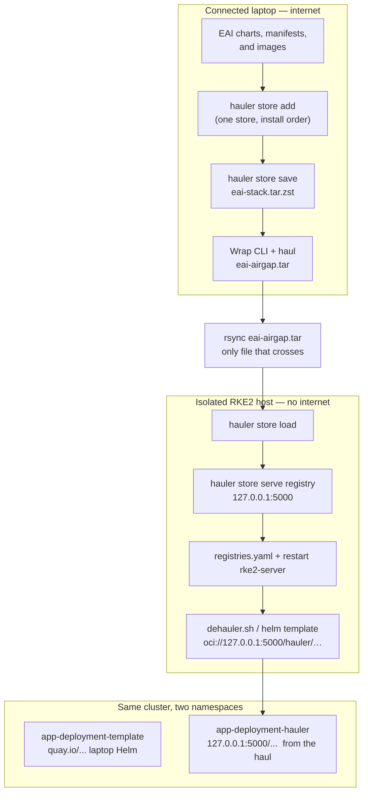

# Airgap EAI with Hauler

Runbook for moving an Enterprise AI (EAI) stack into a disconnected
environment using [Hauler](https://github.com/hauler-dev/hauler).

This note starts with what Hauler is and how to install the CLI, then
packs the EAI apps in Cluster-Forge install order and deploys them on
an isolated cluster.

---

## Introduction

Air-gapped Kubernetes usually means a pile of `docker pull` / `skopeo` /
`helm pull` scripts, tarballs, and a private registry. Hauler folds that
into a **single binary** with no extra runtime dependencies.

It treats assets (container images, Helm charts, files) as **content**
and **collections**, stored as OCI artifacts. The packed archive is a
**haul** (typically `haul.tar.zst`).

Typical flow:

1. **Connected side** — declare what you need (YAML manifest or CLI),
  sync into a local store (`hauler store sync` / `hauler store add`).
2. **Pack** — `hauler store save --filename haul.tar.zst`.
3. **Carry** the tarball across the airgap.
4. **Disconnected side** — `hauler store load`, then either **serve**
  with the built-in registry / fileserver (`hauler store serve registry`)
   or **copy** into an existing registry (`hauler store copy registry://…`).



The left side is packing. The middle is the only transfer. The right side
never pulls Quay: kubelet uses Hauler's registry on localhost.
`app-deployment-template` is the control (Helm from the laptop);
`app-deployment-hauler` is the hauled copy.

Cosign signatures can be verified on both sides. Manifests use API
`content.hauler.cattle.io/v1` (the old `v1alpha` version was dropped in
Hauler v2.0).

Official docs: [docs.hauler.dev](https://docs.hauler.dev/docs/intro).

---

## 1. Install the Hauler binary on both ends

Hauler is a standalone binary: no Docker, Helm, or other runtime is
required to *install* it. Linux, Darwin, and Windows are published for
both `amd64` and `arm64`. Releases: [GitHub Releases](https://github.com/hauler-dev/hauler/releases).

### Linux / Darwin (install script)

The script at `https://get.hauler.dev` downloads the matching release
tarball and places `hauler` on `PATH`.

```bash
# latest release
curl -sfL https://get.hauler.dev | bash

# debug the installer
curl -sfL https://get.hauler.dev | HAULER_DEBUG=true bash

# pin a version (example; use a current tag from GitHub Releases)
curl -sfL https://get.hauler.dev | HAULER_VERSION=1.2.0 bash

# install into a specific directory
curl -sfL https://get.hauler.dev | HAULER_INSTALL_DIR=/usr/bin bash

# use a non-default Hauler home directory
curl -sfL https://get.hauler.dev | HAULER_DIR=$HOME/.hauler bash
```

`hauler.sh` runs that installer if `hauler` is not already on `PATH`. It
also uses `./haul/hauler` when that bundled binary is present.

### Homebrew

```bash
brew tap hauler-dev/homebrew-tap
brew install hauler

# pin a version (example)
brew tap hauler-dev/homebrew-tap
brew install hauler@1.2.0
```

### Manual (Linux / Darwin)

Useful when `curl | bash` is not allowed, or when you already have the
release tarball from a connected host.

```bash
# replace with a real version, platform, and arch from GitHub Releases
export vHauler=2.1.0
export platform=linux   # linux | darwin
export arch=amd64       # amd64 | arm64

curl -sOL "https://github.com/hauler-dev/hauler/releases/download/v${vHauler}/hauler_${vHauler}_${platform}_${arch}.tar.gz"
tar -xf "hauler_${vHauler}_${platform}_${arch}.tar.gz"
sudo mv hauler /usr/bin/hauler
```

On a host where `/usr` is read-only, install under `~/bin` instead and
put that directory on `PATH`.

### Windows

The installer is still listed as **coming soon**. Until then, take the
Windows zip from GitHub Releases and put `hauler.exe` on `PATH`.

### Verify

```bash
hauler version
```

---

## 2. SSH tunnel and kubectl

The Rancher API listens on the VM's **private** IP (`10.0.255.74:6443`).
Reach it from the laptop with a local forward. Leave this running in
its own terminal:

```bash
ssh -N -L 6443:127.0.0.1:6443 -o ProxyJump=none ubuntu@132.145.131.234
```

`-o ProxyJump=none` is required: `Host *` / `Host useocpm2m-silogen-*`
in `~/.ssh/config` would otherwise send the session through `ocijump`.

`test/kubeconfig.yaml` is already pointed at the tunnel:

- `server: https://127.0.0.1:6443`
- `tls-server-name: 10.0.255.74` (API cert is issued for the private IP)

```bash
export KUBECONFIG="$PWD/test/kubeconfig.yaml"
kubectl get nodes
```

---

## 3. Build the complete EAI haul in install order

Hauler does **not** install into Kubernetes. On a machine with internet
it fetches charts, manifests, and images into a local store and writes
one tarball (the **haul**). That file is what you carry across the
airgap. The isolated cluster cannot pull Quay, Docker Hub, or the
laptop; kubelet uses Hauler's embedded registry on localhost (chapter 4).

Do not name the store directory after a Helm chart (`kuberay-operator`,
`kyverno`, …). Hauler fails when the store name matches the chart name.
For local charts, point at the version directory that contains
`Chart.yaml` (for example `kuberay-operator/1.4.2`), not the parent
folder. If `--add-images` misses an image, add it with
`hauler store add image … --store "$EAI_STORE"`. The isolated host
cannot run `curl | bash`, so the CLI is wrapped with the haul in 3.45.

All applications accumulate in one store (`haul/eai-store`) and are
exported as one haul. Do not use `haul/store`; that was only the
Kuberay proof of concept.

Most apps are packed from **local Cluster-Forge charts** under
`haul/cluster-forge/sources/`. Clone that repo on the connected laptop
before 3.1. A few apps are pulled from OCI instead (AIM Engine, AI
Workbench, Kaiwo) and do not need a local chart path.

```bash
cd /home/irodrigu/cache/workspaces/inaki/customer-cases/airgap-hauler
git clone https://github.com/silogen/cluster-forge.git haul/cluster-forge
export EAI_STORE=haul/eai-store
ls haul/cluster-forge/sources/kuberay-operator/1.4.2/Chart.yaml
```

Skip the clone if `haul/cluster-forge` already exists. To pack from a
branch that is not `main`, pass `--branch`. To pack a byok profile
(`default`, `default-cpu`, `demo`, `demo-cpu`) instead of the full
OpenShift stack, pass `--profile` as well:

```bash
./hauler.sh --profile demo --branch EAI-8560-byok none-model-images --skip-transfer
```

The store and the two archives live under `docs/airgap/haul/` and are
tens of gigabytes. Put the clone on a large volume for that host, for
example `/mnt/disk0`, never the 96 GB root disk. See the Demo section.

`--profile` reads `byok/profiles/<name>.yaml` on that branch, including
`extends`, and hauls only those packages. It also writes
`haul-manifest.yaml` and `haul-manifest.json` into the store and into
`eai-airgap.tar`. `dehauler.sh` uses that file to apply only the packed
packages:

```bash
sudo env PATH="/usr/local/bin:/var/lib/rancher/rke2/bin:$PATH" \
  KUBECONFIG=/etc/rancher/rke2/rke2.yaml \
  CF_DOMAIN=spur-iro.silogen.ai \
  ./dehauler.sh /path/to/eai-airgap.tar --confirm
``` The application
order below follows
[`root/values-openshift.yaml`](https://github.com/silogen/cluster-forge/blob/main/root/values-openshift.yaml),
but excludes the OpenShift-only SCC, OpenShift Kyverno, and Route steps.
This chapter only collects transportable application content. Cluster
objects, secrets, runtime values, and installation commands belong in
chapter 4.

For local charts, every command uses `--add-images` so Hauler stores both
the chart and the images found by rendering it. Commands remain separate
and ordered so a failure identifies the exact application.

### 3.1 Kuberay operator

Includes the `ray.io` CRDs in the chart artifact. Applying those CRDs is
a chapter 4 deployment concern.

```bash
hauler store add chart haul/cluster-forge/sources/kuberay-operator/1.4.2 --repo . --add-images --platform linux/amd64 --store "$EAI_STORE"
```

### 3.2 CloudNativePG operator

Needed when `PLUGGABLE_DB=false`. The operator chart does not haul the
Postgres image used by Cluster CRs (`aiwb-cnpg` uses `:17.2`,
`keycloak-old` uses `:17`).

```bash
hauler store add chart haul/cluster-forge/sources/cnpg-operator/0.26.0 --repo . --add-images --platform linux/amd64 --store "$EAI_STORE"
hauler store add image ghcr.io/cloudnative-pg/postgresql:17 --platform linux/amd64 --store "$EAI_STORE"
hauler store add image ghcr.io/cloudnative-pg/postgresql:17.2 --platform linux/amd64 --store "$EAI_STORE"
```

### 3.3 AppWrapper

AppWrapper is a plain manifest rather than a Helm chart, so add both its
manifest and its image explicitly.

```bash
hauler store add file haul/cluster-forge/sources/appwrapper/v1.1.2/install.yaml --name appwrapper-install.yaml --store "$EAI_STORE"
hauler store add image quay.io/ibm/appwrapper:v1.1.2 --platform linux/amd64 --store "$EAI_STORE"
```

### 3.4 Kyverno

Pods name `reg.kyverno.io/kyverno/…`, which `--add-images` may store under a
different host. Pack the tags the chart actually uses so rewrite can map
them onto `127.0.0.1:5000/kyverno/…`.

```bash
hauler store add chart haul/cluster-forge/sources/kyverno/3.5.1 --repo . --add-images --platform linux/amd64 --store "$EAI_STORE"
hauler store add image reg.kyverno.io/kyverno/kyverno:v1.15.1 --platform linux/amd64 --store "$EAI_STORE"
hauler store add image reg.kyverno.io/kyverno/kyvernopre:v1.15.1 --platform linux/amd64 --store "$EAI_STORE"
hauler store add image reg.kyverno.io/kyverno/background-controller:v1.15.1 --platform linux/amd64 --store "$EAI_STORE"
hauler store add image reg.kyverno.io/kyverno/cleanup-controller:v1.15.1 --platform linux/amd64 --store "$EAI_STORE"
hauler store add image reg.kyverno.io/kyverno/reports-controller:v1.15.1 --platform linux/amd64 --store "$EAI_STORE"
```

### 3.5 Kyverno base policies

```bash
hauler store add chart haul/cluster-forge/sources/kyverno-policies/base --repo . --add-images --platform linux/amd64 --store "$EAI_STORE"
```

### 3.6 Kyverno local-path storage policies

```bash
hauler store add chart haul/cluster-forge/sources/kyverno-policies/storage-local-path --repo . --add-images --platform linux/amd64 --store "$EAI_STORE"
```

### 3.7 Prometheus operator CRDs

```bash
hauler store add chart haul/cluster-forge/sources/prometheus-operator-crds/23.0.0 --repo . --add-images --platform linux/amd64 --store "$EAI_STORE"
```

### 3.8 cert-manager

```bash
hauler store add chart haul/cluster-forge/sources/cert-manager/v1.18.2 --repo . --add-images --platform linux/amd64 --store "$EAI_STORE"
```

### 3.9 OpenTelemetry operator

```bash
hauler store add chart haul/cluster-forge/sources/opentelemetry-operator/0.93.1 --repo . --add-images --platform linux/amd64 --store "$EAI_STORE"
hauler store add image ghcr.io/open-telemetry/opentelemetry-collector-releases/opentelemetry-collector-k8s:0.131.1 --platform linux/amd64 --store "$EAI_STORE"
```

AIM Engine's `kgateway-metrics-collector` pulls the `k8s` collector
image (`0.131.1`). The operator chart `--add-images` path hauls contrib,
not that tag.

### 3.10 External Secrets operator

```bash
hauler store add chart haul/cluster-forge/sources/external-secrets/0.19.2 --repo . --add-images --platform linux/amd64 --store "$EAI_STORE"
hauler store add image oci.external-secrets.io/external-secrets/external-secrets:v0.19.2 --platform linux/amd64 --store "$EAI_STORE"
```

### 3.11 Gateway API and Envoy Gateway CRDs

The source bundle and OpenShift values use `v1.8.4`. Its CRD subchart
carries both the Gateway API CRDs and generated Envoy Gateway CRDs, so
add it once.

```bash
hauler store add chart haul/cluster-forge/sources/envoy-gateway/v1.8.4/charts/crds --repo . --add-images --platform linux/amd64 --store "$EAI_STORE"
```

### 3.12 OpenBao

```bash
hauler store add chart haul/cluster-forge/sources/openbao/0.18.2 --repo . --add-images --platform linux/amd64 --store "$EAI_STORE"
```

### 3.13 OpenBao configuration

```bash
hauler store add chart haul/cluster-forge/sources/openbao-config/0.1.0 --repo . --add-images --platform linux/amd64 --store "$EAI_STORE"
```

### 3.14 OpenBao initialization job

```bash
hauler store add chart haul/cluster-forge/sources/openbao-init-job/0.1.0 --repo . --add-images --platform linux/amd64 --store "$EAI_STORE"
```

### 3.15 External Secrets configuration

This is a plain manifest.

```bash
hauler store add file haul/cluster-forge/sources/external-secrets-config/openbao-secret-store.yaml --name external-secrets-openbao-secret-store.yaml --store "$EAI_STORE"
```

### 3.16 OpenTelemetry LGTM stack

```bash
hauler store add chart haul/cluster-forge/sources/otel-lgtm-stack/v1.0.7 --repo . --add-images --platform linux/amd64 --store "$EAI_STORE"
hauler store add image docker.io/curlimages/curl:8.8.0 --platform linux/amd64 --store "$EAI_STORE"
```

The Grafana-dashboard init Job uses `curlimages/curl:8.8.0`; chart
`--add-images` does not haul it.

### 3.17 KEDA

```bash
hauler store add chart haul/cluster-forge/sources/keda/2.18.1 --repo . --add-images --platform linux/amd64 --store "$EAI_STORE"
```

### 3.18 Kedify OpenTelemetry scaler

```bash
hauler store add chart haul/cluster-forge/sources/kedify-otel/v0.0.6 --repo . --add-images --platform linux/amd64 --store "$EAI_STORE"
hauler store add image docker.io/otel/opentelemetry-collector-k8s:0.114.0 --platform linux/amd64 --store "$EAI_STORE"
```

The sidecar is `otel/opentelemetry-collector-k8s:0.114.0`, not the
`0.131.1` collector hauled with the OTel operator.

### 3.19 Inference Extension CRDs

```bash
hauler store add chart haul/cluster-forge/sources/inference-extension-crds/v1.5.0 --repo . --add-images --platform linux/amd64 --store "$EAI_STORE"
```

### 3.20 Envoy AI Gateway CRDs

```bash
hauler store add chart haul/cluster-forge/sources/envoy-ai-gateway-crds/v1.0.0 --repo . --add-images --platform linux/amd64 --store "$EAI_STORE"
```

### 3.21 Envoy Gateway

```bash
hauler store add chart haul/cluster-forge/sources/envoy-gateway/v1.8.4 --repo . --add-images --platform linux/amd64 --store "$EAI_STORE"
hauler store add image docker.io/envoyproxy/envoy:distroless-v1.38.4 --platform linux/amd64 --store "$EAI_STORE"
```

`--add-images` hauls the **controller**. Data-plane pods are created later
from `docker.io/envoyproxy/envoy:distroless-v1.38.4`. Pack that tag
explicitly; 4.4.21 also `--set global.images.envoyProxy.image` and 4.4.23a
patches EnvoyProxy CRs.

### 3.22 Envoy AI Gateway

```bash
hauler store add chart haul/cluster-forge/sources/envoy-ai-gateway/v1.0.0 --repo . --add-images --platform linux/amd64 --store "$EAI_STORE"
```

### 3.23 Envoy Gateway configuration

```bash
hauler store add chart haul/cluster-forge/sources/envoy-gateway-config --repo . --add-images --platform linux/amd64 --store "$EAI_STORE"
```

### 3.24 KServe CRDs

```bash
hauler store add chart haul/cluster-forge/sources/kserve-crds/v0.16.0 --repo . --add-images --platform linux/amd64 --store "$EAI_STORE"
```

### 3.25 KServe

The same chart also contains the serving-runtime templates used by the
later `kserve-serving-runtimes` deployment step, so it is hauled once.

```bash
hauler store add chart haul/cluster-forge/sources/kserve/v0.16.0 --repo . --add-images --platform linux/amd64 --store "$EAI_STORE"
hauler store add image docker.io/kserve/kserve-controller:v0.16.0 --platform linux/amd64 --store "$EAI_STORE"
```

### 3.26 AMD GPU Operator and CRDs

The operator and CRD steps use the same chart artifact. Add it once;
chapter 4 will render the appropriate CRD and operator portions.

```bash
hauler store add chart haul/cluster-forge/sources/amd-gpu-operator/v1.4.1 --repo . --add-images --platform linux/amd64 --store "$EAI_STORE"
```

### 3.27 AMD GPU Operator configuration

Do not use `--add-images` on this chart. The DeviceConfig example pins
`spec.driver.image` to the dummy `imageregistry.io/username/repo` (in-cluster
driver builds replace that at install time). Hauler treats it as
`imageregistry.io/username/repo:latest`, DNS fails, and the whole add
aborts — including the real ROCm images.

Pack the chart as a file artifact, then add the images that are actually
needed:

```bash
hauler store add chart haul/cluster-forge/sources/amd-gpu-operator-config/v1.4.1 --repo . --platform linux/amd64 --store "$EAI_STORE"
hauler store add image docker.io/rocm/device-metrics-exporter:v1.4.1 --platform linux/amd64 --store "$EAI_STORE"
hauler store add image docker.io/rocm/device-config-manager:v1.4.1 --platform linux/amd64 --store "$EAI_STORE"
hauler store add image docker.io/rocm/test-runner:v1.4.1 --platform linux/amd64 --store "$EAI_STORE"
```

### 3.28 AIM Engine CRDs

This chart is fetched from the EAI OCI registry rather than the local
`sources/` tree.

```bash
hauler store add chart aim-engine-crds-chart --repo oci://registry-1.docker.io/amdenterpriseai --version 0.2.5 --add-images --platform linux/amd64 --store "$EAI_STORE"
```

### 3.29 AIM Engine

```bash
hauler store add chart aim-engine-chart --repo oci://registry-1.docker.io/amdenterpriseai --version 0.2.5 --add-images --platform linux/amd64 --store "$EAI_STORE"
```

### 3.30 AI Workbench CNPG infrastructure

Needed when `PLUGGABLE_DB=false`.

```bash
hauler store add chart aiwb-cnpg-chart --repo oci://registry-1.docker.io/amdenterpriseai --version 2.0.0 --add-images --platform linux/amd64 --store "$EAI_STORE"
```

### 3.31 Keycloak

The internal-CNPG and external-database deployment branches use the same
chart; package it once and choose the values in chapter 4.

```bash
hauler store add chart haul/cluster-forge/sources/keycloak-old --repo . --add-images --platform linux/amd64 --store "$EAI_STORE"
```

### 3.32 SeaweedFS CRDs — nothing to haul

`root/values.yaml` pins SeaweedFS to **0.1.36**, where the operator
chart owns the `Seaweed` CRD (`crds.create`) and
`sources/seaweedfs-crds/0.1.36` is only a deprecation stub. Hauling the
older standalone `seaweedfs-crds/0.1.13` manifest installs a schema
without `.spec.s3`, and 4.4.34 then fails with:

```text
failed to create typed patch object (seaweedfs-instance/seaweed): .spec.s3: field not declared in schema
```

### 3.33 SeaweedFS operator

Needed when `PLUGGABLE_S3=false`. Brings the CRD with it.

```bash
hauler store add chart haul/cluster-forge/sources/seaweedfs-operator/0.1.36 --repo . --add-images --platform linux/amd64 --store "$EAI_STORE"
hauler store add image docker.io/chrislusf/seaweedfs-operator:1.0.33 --platform linux/amd64 --store "$EAI_STORE"
```

### 3.34 SeaweedFS configuration

Needed when `PLUGGABLE_S3=false`.

```bash
hauler store add chart haul/cluster-forge/sources/seaweedfs-config --repo . --add-images --platform linux/amd64 --store "$EAI_STORE"
hauler store add image docker.io/chrislusf/seaweedfs:4.40 --platform linux/amd64 --store "$EAI_STORE"
```

### 3.35 AI Workbench

Chart values use the short Docker Hub name `amdenterpriseai/…`. Pack those
tags so rewrite can send them to `127.0.0.1:5000/amdenterpriseai/…`.

```bash
hauler store add chart aiwb-chart --repo oci://registry-1.docker.io/amdenterpriseai --version 2.0.0 --add-images --platform linux/amd64 --store "$EAI_STORE"
hauler store add image docker.io/amdenterpriseai/aiwb-api:2.0.0 --platform linux/amd64 --store "$EAI_STORE"
hauler store add image docker.io/amdenterpriseai/aiwb-ui:2.0.0 --platform linux/amd64 --store "$EAI_STORE"
```

### 3.36 AI Gateway Discovery

```bash
hauler store add chart ai-gateway-discovery-chart --repo oci://registry-1.docker.io/amdenterpriseai --version 2.0.0 --add-images --platform linux/amd64 --store "$EAI_STORE"
hauler store add image docker.io/amdenterpriseai/ai-gateway-discovery:2.0.0 --platform linux/amd64 --store "$EAI_STORE"
```

### 3.37 RabbitMQ Cluster Operator

RabbitMQ is a plain manifest, so add its manifest and image explicitly.

```bash
hauler store add file haul/cluster-forge/sources/rabbitmq/v2.15.0/cluster-operator.yml --name rabbitmq-cluster-operator.yaml --store "$EAI_STORE"
hauler store add image docker.io/rabbitmqoperator/cluster-operator:2.15.0 --platform linux/amd64 --store "$EAI_STORE"
hauler store add image ghcr.io/silogen/kubectl:latest --platform linux/amd64 --store "$EAI_STORE"
```

`ghcr.io/silogen/kubectl:latest` is the node-label CronJob in `default`.

### 3.38 Kueue

```bash
hauler store add chart haul/cluster-forge/sources/kueue/0.13.0 --repo . --add-images --platform linux/amd64 --store "$EAI_STORE"
```

### 3.39 Kueue configuration

```bash
hauler store add file haul/cluster-forge/sources/kueue-config/kueue-cluster-role-binding.yaml --name kueue-cluster-role-binding.yaml --store "$EAI_STORE"
```

### 3.40 Kaiwo CRDs

```bash
hauler store add chart kaiwo-crds-chart --repo oci://ghcr.io/silogen --version v0.2.1 --add-images --platform linux/amd64 --store "$EAI_STORE"
```

### 3.41 Kaiwo operator

```bash
hauler store add chart kaiwo-operator-chart --repo oci://ghcr.io/silogen --version v0.2.1 --add-images --platform linux/amd64 --store "$EAI_STORE"
```

### 3.42 Kaiwo configuration

These are plain manifests. The credentials file may contain secrets:
review it before adding it to a portable haul and prefer generating
production credentials on the isolated side.

```bash
hauler store add file haul/cluster-forge/sources/kaiwo-config/pvc-user-demo.yaml --name kaiwo-pvc-user-demo.yaml --store "$EAI_STORE"
hauler store add file haul/cluster-forge/sources/kaiwo-config/minio-credentials.yaml --name kaiwo-minio-credentials.yaml --store "$EAI_STORE"
```

### 3.43 AIM cluster model source

Pick one mode. The chart is packed in both. The difference is which
AIM **model** images (the catalog filters, typically tens of GB each)
go into the store.

**all-model-images** — official path. `--add-images` discovers every
`filters[].image` in the rendered chart (31 images with the default
empty `hardwareFamilies`) and pulls them all.

```bash
hauler store add chart haul/cluster-forge/sources/aim-cluster-model-source --repo . --add-images --platform linux/amd64 --store "$EAI_STORE"
```

**none-model-images** — pack the chart only, then add zero or more
images by name. Use this for a smaller test haul. Omit the `store add
image` lines to carry no **AIM catalog** images. Platform images (Kyverno,
SeaweedFS, AIWB, Envoy data-plane, …) are still packed in earlier steps.

```bash
hauler store add chart haul/cluster-forge/sources/aim-cluster-model-source --repo . --platform linux/amd64 --store "$EAI_STORE"
hauler store add image amdenterpriseai/aim-qwen-qwen3-32b:0.13.0 --platform linux/amd64 --store "$EAI_STORE"
```

`hauler.sh` accepts the same names: `./hauler.sh all-model-images` or
`./hauler.sh none-model-images [image …]`. Add `--profile` and
`--branch` to pack a byok profile from a feature branch.


### 3.44 Steps that are not charts or images

The OpenShift values file also contains steps that do not map to a chart or an
image. Most of them still have something to haul, and `hauler.sh` renders it at
pack time, because the values file and the scripts it references only exist on
this side of the gap:

| Step | What is hauled | Store name |
|---|---|---|
| Kyverno local-path access mode | `extraManifests` | `04-local-path-access-mode-scoped.yaml` |
| AI gateway base objects | `extraManifests` | `06-ai-gateway.yaml` |
| AI gateway webhook health | the probe script | `ai-gateway-webhook-health.sh` |
| AMD GPU `NodeFeatureRule` | `extraManifests` | `08-amd-gpu-nodefeaturerule.yaml` |
| AIWB namespaces and secrets | inline `extraObjects` | `objects-aiwb-infra.yaml` |
| AIWB database credentials | inline `extraObjects` | `objects-aiwb-infra-{cnpg,db}-secrets.yaml` |
| cluster-auth shim | `extraObjects` + the script as a ConfigMap | `objects-cluster-auth-shim.yaml` |
| SeaweedFS credentials | inline `extraObjects` | `objects-seaweedfs-secrets.yaml` |
| External MinIO redirect | inline `extraObjects` | `objects-minio-external-redirect.yaml` |

The rendered bundles keep their `${VAR}` references: the values are the
deployment's, not the haul's, so chapter 4 expands them.

The cluster-auth shim runs a stock python image, so `python:3.11-slim` is
hauled with it.

What is left has nothing to haul, because the source is the cluster rather
than a file — the StorageClasses, and the OpenBao ConfigMap copies. Chapter 4
implements those directly.

The explicitly excluded OpenShift-only payloads are custom SCCs,
OpenShift Kyverno policies, ingress-controller patches, and OpenShift
Routes.

### 3.45 Validate and save the complete haul

Inspect the store before writing the archive. In particular, verify that
every chart with workloads has corresponding image entries.

```bash
hauler store info --store "$EAI_STORE"
hauler store save --filename haul/eai-stack.tar.zst --store "$EAI_STORE"
cp "$(command -v hauler)" haul/hauler
cp dehauler.sh haul/dehauler.sh
tar -C haul -cf haul/eai-airgap.tar hauler dehauler.sh eai-stack.tar.zst
ls -lh haul/eai-stack.tar.zst haul/eai-airgap.tar
```

Only the wrapper archive crosses the airgap. `rsync --info=progress2`
prints percent, speed, and remaining time (this file is tens of GB):

```bash
rsync -ah --info=progress2 -e "ssh -o ProxyJump=none" haul/eai-airgap.tar ubuntu@132.145.131.234:~/
```

---

## 4. Dehauling — load and run on the isolated host

`dehauler.sh` performs this entire chapter: it loads the haul when the
store is absent, starts and checks the localhost registry, configures
and restarts RKE2 when needed, waits for the node, then installs the
apps. No outbound pulls.

The script auto-detects the project layout (`dehauler.sh` above
`haul/`) and wrapper layout (`dehauler.sh` beside the archive). Only
set these variables for a different layout. Point `HAUL_ROOT` at a
large volume, never the 96 GB root disk.

```bash
export HAUL_ROOT=/mnt/disk1/airgap-hauler/haul
export EAI_STORE="$HAUL_ROOT/eai-store"
export TMPDIR="$HAUL_ROOT/tmp"
mkdir -p "$EAI_STORE" "$TMPDIR"
```

After an airgap `rsync` the same files are often in the `ubuntu` home
directory; only `HAUL_ROOT` changes.

Expected contents under `$HAUL_ROOT` (either the wrapper, or the haul
plus a `hauler` binary already on `PATH`):

```text
eai-airgap.tar          # optional wrapper: hauler + dehauler.sh + eai-stack.tar.zst
eai-stack.tar.zst       # the haul (charts, files, images)
hauler                  # linux/amd64 CLI, if you unpacked the wrapper
dehauler.sh             # apply every hauled app (4.4)
```

### 4.1 Load the haul

If you have the wrapper, unpack it first. Loading writes the store at
`$EAI_STORE`.

```bash
cd "$HAUL_ROOT"
tar -xf eai-airgap.tar
chmod +x hauler dehauler.sh
./hauler store load --filename eai-stack.tar.zst --store "$EAI_STORE"
./hauler store info --store "$EAI_STORE"
```

If `eai-stack.tar.zst` is already there and `hauler` is on `PATH`
(this host packed the haul itself):

```bash
cd "$HAUL_ROOT"
hauler store load --filename eai-stack.tar.zst --store "$EAI_STORE"
hauler store info --store "$EAI_STORE"
```

A none-model-images haul still lists `hauler/aim-cluster-model-source`
and AIM Engine, but not the 31 catalog model tags.

### 4.2 Serve the local registry

This is a long-running process. Default is port 5000 on this host only.
Start it in the background so the same shell can continue 4.3 and 4.4.
It must stay up while Helm/kubectl pull from localhost.

```bash
nohup hauler store serve registry --store "$EAI_STORE" >"$HAUL_ROOT/hauler-registry.log" 2>&1 &
ss -ltn 'sport = :5000'
```

`serve registry` is not a fleet registry. For many nodes, copy the
store into Harbor (or similar) with `hauler store copy registry://…`
instead of this process on every machine.

### 4.3 RKE2 HTTP mirror

RKE2/containerd must treat `127.0.0.1:5000` as HTTP. Once per node,
not per app. Create the file if it does not exist, then edit it:

```bash
sudo touch /etc/rancher/rke2/registries.yaml
```

```yaml
# /etc/rancher/rke2/registries.yaml
mirrors:
  "127.0.0.1:5000":
    endpoint:
      - "http://127.0.0.1:5000"
```

Restart RKE2 so containerd reloads the file. This node is a server
(control-plane); on a worker it would be `rke2-agent`.

```bash
sudo systemctl restart rke2-server
```

### 4.4 Apply every hauled app

Same Cluster-Forge order as chapter 3 (OpenShift-only payloads stay
out). Charts come from `oci://127.0.0.1:5000/hauler/<chart>` with
`--plain-http`. Files come from `hauler store extract`. Namespaces
match `root/values.yaml` (Kuberay is `default`, not the earlier
`app-deployment-hauler` POC namespace).

Helm 4 prints `Pulled:` / `Digest:` on **stdout** before the
manifests; drop those two lines or kubectl fails with `apiVersion not
set`. Image references in the render still name `quay.io`, `docker.io`,
`ghcr.io`, and so on. Rewrite those hosts to `127.0.0.1:5000` (Hauler
serves the path after the original registry). Confirm chart names and
versions with `hauler store info --store "$EAI_STORE"` if a `--version`
below does not match your haul.

Four rules make `helm template | kubectl apply` behave like
`helm install`. Each was a real failure in this lab:

- **`kubectl apply -n <ns>`** — charts leave `metadata.namespace` off
  namespaced objects and rely on Helm's release namespace. Without
  `-n`, they land in `default`. KServe's ServiceAccount does this, and
  the controller then never starts:
  `error looking up service account kserve-system/kserve-controller-manager`.
- **`--no-hooks`** — `helm template` renders `helm.sh/hook` Pods and
  Jobs, which kubectl applies as ordinary workloads. Kyverno's
  `pre-install` hooks are destructive here: `kyverno-scale-to-zero`
  scales all four controllers to `0/0` and
  `kyverno-remove-*webhookconfiguration` deletes its webhooks.
- **Wait between steps** — a chart's CRs are validated by a webhook
  whose pod may not be serving yet:
  `failed calling webhook "webhook.cert-manager.io": no endpoints
  available for service "cert-manager-webhook"`. KServe is worse: one
  chart holds both the webhook and the `ClusterServingRuntime`s it
  validates, so the first apply always loses and must be retried.
- **`external-secrets.io/v1beta1` → `v1`** — the 0.19.2 CRDs no longer
  serve `v1beta1`, while several Cluster-Forge sources still declare
  it. `values-openshift.yaml` applies the same substitution.
- **Image hosts → `127.0.0.1:5000`** — besides `docker.io` / `quay.io` /
  `ghcr.io` / `registry.k8s.io`, rewrite `reg.kyverno.io/` and
  `oci.external-secrets.io/`, and Docker Hub `org/name:tag` (one slash,
  no dot in the first segment). Without that last rule, AIWB, SeaweedFS,
  KServe, and RabbitMQ keep short names that resolve to the internet.

`dehauler.sh` does all five. Prefer it over pasting the blocks below.

Set the same env as 4.1, plus domain for charts that take `--set
domain`. Copy `dehauler.sh` onto the host if it is not already in the
wrapper.

```bash
export HAUL_ROOT=/mnt/disk0/haul-airgap
export EAI_STORE="$HAUL_ROOT/store"
export TMPDIR="$HAUL_ROOT/tmp"
export LOCAL_REG=127.0.0.1:5000
export CF_DOMAIN=MY-HAULER-DOMAIN
# Optional: create cluster-tls from files if the secret is not already in
# envoy-gateway-system. Otherwise dehauler.sh prompts for the paths.
# export CLUSTER_TLS_CERT=/path/to/fullchain.pem
# export CLUSTER_TLS_KEY=/path/to/privkey.pem
```

`dehauler.sh` refuses to start the charts until Secret `cluster-tls`
exists in `envoy-gateway-system`. That is the wildcard/domain
certificate the Gateway listeners terminate TLS with (SANs must cover
`*.${CF_DOMAIN}`). Cluster-Forge copies it from the OpenShift router
cert; that branch does not run here. Create it before the script, or
let the script prompt:

```bash
kubectl create namespace envoy-gateway-system --dry-run=client -o yaml | kubectl apply -f -
kubectl create secret tls cluster-tls -n envoy-gateway-system \
  --cert=/path/to/fullchain.pem --key=/path/to/privkey.pem
```

Use the full chain, not the leaf. This is **not** Secret `envoy-gateway`
(the control-plane webhook cert); step 4.4.21a mints that one.

Run one command from the directory containing `dehauler.sh`. It must
run as root because it writes `/etc/rancher/rke2/registries.yaml` and
restarts `rke2-server`. Existing registry configuration is timestamped
as a backup before replacement. The registry itself runs under
`nohup`; its log and PID are saved under `HAUL_ROOT`.

Default waits for Deployments in that namespace, then continues.
`--confirm` additionally pauses after each step so you can wait for
CNPG initdb, webhook endpoints, or OpenBao (needs a TTY; do not
`nohup` the script):

```bash
chmod +x dehauler.sh
sudo ./dehauler.sh --confirm
sudo ./dehauler.sh --from 25 --confirm
./dehauler.sh --dry-run
```

The commands below are what that script runs. `kubectl apply` is
cluster-wide (CRDs and ClusterRoles are not namespaced). Create each
namespace first.

If Helm is missing, render each chart on a connected laptop, add the
YAML as a Hauler `File` in chapter 3, then extract and apply on the
host.

#### 4.4.0a local-path provisioner and the StorageClass named "default"

Three of the four things Cluster-Forge's handler does are OpenShift's: the
SCC, the helper-pod SELinux context, and relabelling the backing directory
through `oc debug`. RKE2 ships `rancher.io/local-path` built in, so what is
left is the StorageClass literally named `default` — required by name, not by
role, because otel-lgtm-stack's PVCs, the Keycloak CNPG cluster and the
rabbitmq values all hardcode that string. Without it those PVCs stay Pending
whatever the cluster default is.

The upstream provisioner manifest is deliberately never fetched: it is a URL,
and there is no network here.

```bash
kubectl get storageclass default >/dev/null 2>&1 || kubectl apply --server-side -f - <<'EOF'
apiVersion: storage.k8s.io/v1
kind: StorageClass
metadata:
  name: default
provisioner: rancher.io/local-path
reclaimPolicy: Delete
volumeBindingMode: WaitForFirstConsumer
EOF

# Claim the cluster-default seat only if it is empty: a cluster that already
# nominated one has real storage behind it, and two defaults is worse than none.
kubectl get storageclass -o jsonpath='{range .items[*]}{.metadata.name}={.metadata.annotations.storageclass\.kubernetes\.io/is-default-class}{"\n"}{end}' | grep -q '=true$' \
  || kubectl patch storageclass default -p '{"metadata":{"annotations":{"storageclass.kubernetes.io/is-default-class":"true"}}}'
```

#### 4.4.1 Kuberay operator

```bash
kubectl create namespace default --dry-run=client -o yaml | kubectl apply -f -
helm template kuberay-operator oci://127.0.0.1:5000/hauler/kuberay-operator --version 1.4.2 --plain-http --include-crds --no-hooks --namespace default --set image.repository=127.0.0.1:5000/kuberay/operator --set image.tag=v1.4.2 | sed '/^Pulled:/d;/^Digest:/d;s#quay.io/#127.0.0.1:5000/#g;s#docker.io/#127.0.0.1:5000/#g;s#ghcr.io/#127.0.0.1:5000/#g' | kubectl apply -n default --server-side --force-conflicts -f -
kubectl -n default get deploy,pods -o wide
```

The operator image should be `127.0.0.1:5000/kuberay/operator:v1.4.2`,
not `quay.io/...`.

#### 4.4.2 CloudNativePG operator

```bash
kubectl create namespace cnpg-system --dry-run=client -o yaml | kubectl apply -f -
helm template cnpg-operator oci://127.0.0.1:5000/hauler/cloudnative-pg --version 0.26.0 --plain-http --include-crds --no-hooks --namespace cnpg-system | sed '/^Pulled:/d;/^Digest:/d;s#quay.io/#127.0.0.1:5000/#g;s#docker.io/#127.0.0.1:5000/#g;s#ghcr.io/#127.0.0.1:5000/#g' | kubectl apply -n cnpg-system --server-side --force-conflicts -f -
```

#### 4.4.3 AppWrapper

```bash
kubectl create namespace appwrapper-system --dry-run=client -o yaml | kubectl apply -f -
hauler store extract hauler/appwrapper-install.yaml:latest --store "$EAI_STORE" -o "$HAUL_ROOT/extracted"
sed '/^Pulled:/d;/^Digest:/d;s#quay.io/#127.0.0.1:5000/#g;s#docker.io/#127.0.0.1:5000/#g;s#ghcr.io/#127.0.0.1:5000/#g' "$HAUL_ROOT/extracted/appwrapper-install.yaml" | kubectl apply --server-side --force-conflicts -f -
```

#### 4.4.4 Kyverno

```bash
kubectl create namespace kyverno --dry-run=client -o yaml | kubectl apply -f -
helm template kyverno oci://127.0.0.1:5000/hauler/kyverno --version 3.5.1 --plain-http --include-crds --no-hooks --namespace kyverno --set webhooksCleanup.enabled=false --set reportsController.resources.limits.memory=1Gi --set reportsController.resources.requests.memory=256Mi | sed '/^Pulled:/d;/^Digest:/d;s#quay.io/#127.0.0.1:5000/#g;s#docker.io/#127.0.0.1:5000/#g;s#ghcr.io/#127.0.0.1:5000/#g;s#registry.k8s.io/#127.0.0.1:5000/#g' | kubectl apply -n kyverno --server-side --force-conflicts -f -
```

#### 4.4.5 Kyverno base policies

```bash
helm template kyverno-policies-base oci://127.0.0.1:5000/hauler/kyverno-policies-base --version 1.0.0 --plain-http --include-crds --no-hooks --namespace kyverno | sed '/^Pulled:/d;/^Digest:/d' | kubectl apply -n kyverno --server-side --force-conflicts -f -
```

#### 4.4.6 Kyverno local-path storage policies

```bash
helm template kyverno-policies-storage-local-path oci://127.0.0.1:5000/hauler/kyverno-policies-storage-local-path --version 1.0.0 --plain-http --include-crds --no-hooks --namespace kyverno | sed '/^Pulled:/d;/^Digest:/d' | kubectl apply -n kyverno --server-side --force-conflicts -f -
```

#### 4.4.6a local-path access mode policy

The step declares `extraManifests` as well as a chart, and the policy that
scopes local-path PVCs to `ReadWriteOnce` is only in the manifest.

```bash
hauler store extract hauler/04-local-path-access-mode-scoped.yaml:latest --store "$EAI_STORE" -o "$HAUL_ROOT/extracted"
kubectl apply -n kyverno --server-side --force-conflicts -f "$HAUL_ROOT/extracted/04-local-path-access-mode-scoped.yaml"
```

#### 4.4.6b Workspace StorageClasses

`multinode` and `mlstorage` are aliases of local-path, not separate backends,
created because charts and the storage policies name them. An existing class
of either name is left alone.

```bash
for name in multinode mlstorage; do
  kubectl get storageclass "$name" >/dev/null 2>&1 && continue
  kubectl apply --server-side -f - <<EOF
apiVersion: storage.k8s.io/v1
kind: StorageClass
metadata:
  name: ${name}
provisioner: rancher.io/local-path
reclaimPolicy: Delete
volumeBindingMode: WaitForFirstConsumer
EOF
done
```

#### 4.4.7 Prometheus operator CRDs

```bash
kubectl create namespace prometheus-system --dry-run=client -o yaml | kubectl apply -f -
helm template prometheus-operator-crds oci://127.0.0.1:5000/hauler/prometheus-operator-crds --version 23.0.0 --plain-http --include-crds --no-hooks --namespace prometheus-system | sed '/^Pulled:/d;/^Digest:/d' | kubectl apply -n prometheus-system --server-side --force-conflicts -f -
```

#### 4.4.8 cert-manager

```bash
kubectl create namespace cert-manager --dry-run=client -o yaml | kubectl apply -f -
helm template cert-manager oci://127.0.0.1:5000/hauler/cert-manager --version v1.18.2 --plain-http --include-crds --no-hooks --namespace cert-manager --set installCRDs=true | sed '/^Pulled:/d;/^Digest:/d;s#quay.io/#127.0.0.1:5000/#g;s#docker.io/#127.0.0.1:5000/#g;s#ghcr.io/#127.0.0.1:5000/#g;s#registry.k8s.io/#127.0.0.1:5000/#g' | kubectl apply -n cert-manager --server-side --force-conflicts -f -
```

#### 4.4.9 OpenTelemetry operator

```bash
kubectl create namespace opentelemetry-operator-system --dry-run=client -o yaml | kubectl apply -f -
helm template opentelemetry-operator oci://127.0.0.1:5000/hauler/opentelemetry-operator --version 0.93.1 --plain-http --include-crds --no-hooks --namespace opentelemetry-operator-system | sed '/^Pulled:/d;/^Digest:/d;s#quay.io/#127.0.0.1:5000/#g;s#docker.io/#127.0.0.1:5000/#g;s#ghcr.io/#127.0.0.1:5000/#g' | kubectl apply -n opentelemetry-operator-system --server-side --force-conflicts -f -
```

#### 4.4.10 External Secrets operator

```bash
kubectl create namespace external-secrets --dry-run=client -o yaml | kubectl apply -f -
helm template external-secrets oci://127.0.0.1:5000/hauler/external-secrets --version 0.19.2 --plain-http --include-crds --no-hooks --namespace external-secrets | sed '/^Pulled:/d;/^Digest:/d;s#quay.io/#127.0.0.1:5000/#g;s#docker.io/#127.0.0.1:5000/#g;s#ghcr.io/#127.0.0.1:5000/#g' | kubectl apply -n external-secrets --server-side --force-conflicts -f -
```

#### 4.4.11 Gateway API and Envoy Gateway CRDs

The hauled chart name is `crds` (version `0.0.0`), not `envoy-gateway`.

```bash
kubectl create namespace envoy-gateway-system --dry-run=client -o yaml | kubectl apply -f -
helm template envoy-gateway-crds oci://127.0.0.1:5000/hauler/crds --version 0.0.0 --plain-http --include-crds --no-hooks --namespace envoy-gateway-system | sed '/^Pulled:/d;/^Digest:/d' | kubectl apply -n envoy-gateway-system --server-side --force-conflicts -f -
```

#### 4.4.12 OpenBao

```bash
kubectl create namespace cf-openbao --dry-run=client -o yaml | kubectl apply -f -
helm template openbao oci://127.0.0.1:5000/hauler/openbao --version 0.18.2 --plain-http --include-crds --no-hooks --namespace cf-openbao --set injector.enabled=false --set server.ha.enabled=false --set ui.enabled=true | sed '/^Pulled:/d;/^Digest:/d;s#quay.io/#127.0.0.1:5000/#g;s#docker.io/#127.0.0.1:5000/#g;s#ghcr.io/#127.0.0.1:5000/#g' | kubectl apply -n cf-openbao --server-side --force-conflicts -f -
```

#### 4.4.13 OpenBao configuration

```bash
helm template openbao-config oci://127.0.0.1:5000/hauler/openbao-config --version 0.1.0 --plain-http --include-crds --no-hooks --namespace cf-openbao --set domain=MY-HAULER-DOMAIN --set minio.apiAccessKey=placeholder --set minio.consoleAccessKey=placeholder | sed '/^Pulled:/d;/^Digest:/d;s#quay.io/#127.0.0.1:5000/#g;s#docker.io/#127.0.0.1:5000/#g;s#ghcr.io/#127.0.0.1:5000/#g' | kubectl apply -n cf-openbao --server-side --force-conflicts -f -
```

> **Lettered steps (4.4.0a, 4.4.6a/b, 4.4.13b, ...)**
>
> Cluster-Forge's install order contains steps that are neither a chart nor a
> file: inline `extraObjects` in `values-openshift.yaml`, `extraManifests`
> under `docs/openshift/extra/`, and `mode: custom` handlers that read the
> cluster back. `hauler.sh` renders the first two to files at pack time, so
> the disconnected side needs only the store; the handlers are reimplemented
> in `dehauler.sh`. They keep letters rather than renumbering, so `--from N`
> means the same thing it always did, and each is gated on the *following*
> integer step so resuming never skips a prerequisite.
>
> Only the steps that are OpenShift's alone are left out: the SCCs
> (`01`, `02`, `03`), the OpenShift Kyverno policies (`05`), and the
> Routes (`09`). The router wildcard certificate copy is replaced by
> the `cluster-tls` check at the start of `dehauler.sh`.
>
> The rendered object bundles keep their `${VAR}` references, because the
> values are the deployment's and not the haul's. `dehauler.sh` expands them
> from the environment and refuses to apply a bundle with any of them unset,
> since a Secret rendered with an empty access key installs cleanly and is
> quietly wrong. The defaults are `install.sh`'s, so the manual commands below
> need the same variables exported:
>
> ```bash
> export DOMAIN=MY-HAULER-DOMAIN
> export MINIO_API_ACCESS_KEY=placeholder MINIO_API_SECRET_KEY=placeholder
> export MINIO_CONSOLE_ACCESS_KEY=placeholder MINIO_CONSOLE_SECRET_KEY=placeholder
> export KEYCLOAK_INITIAL_ADMIN_PASSWORD=placeholder KEYCLOAK_INITIAL_DEVUSER_PASSWORD=placeholder
> export AIWB_DB_USER=aiwb_user AIWB_DB_PASSWORD=examplepassword
> export KEYCLOAK_DB_USER=keycloak KEYCLOAK_DB_PASSWORD=examplepassword
> export AIWB_CNPG_SUPERUSER_USER=placeholder AIWB_CNPG_SUPERUSER_PASSWORD=placeholder
> export KEYCLOAK_CNPG_SUPERUSER_USER=placeholder KEYCLOAK_CNPG_SUPERUSER_PASSWORD=placeholder
> ```
>
> `PLUGGABLE_DB` and `PLUGGABLE_S3` both default to `false`: the cluster runs
> its own PostgreSQL and object store. Three steps below belong to the other
> shape and are skipped by default — `4.4.29d`, `4.4.31b` and `4.4.34b`.

#### 4.4.13b OpenBao init ConfigMap aliases

The init job mounts the two ConfigMaps of 4.4.13 under different names, and
no chart creates those names: `values-openshift.yaml` does it with the
`step_copy_objects` handler, which has no chart or file to haul.

```bash
for pair in openbao-secrets-config:openbao-secrets-init-config openbao-secret-manager-scripts:openbao-secret-manager-scripts-init; do
  kubectl -n cf-openbao get configmap "${pair%%:*}" -o yaml \
    | yq "del(.status, .metadata.resourceVersion, .metadata.uid, .metadata.creationTimestamp, .metadata.generation, .metadata.managedFields, .metadata.ownerReferences, .metadata.annotations.\"kubectl.kubernetes.io/last-applied-configuration\") | .metadata.name = \"${pair##*:}\"" \
    | kubectl apply -n cf-openbao --server-side --force-conflicts -f -
done
```

Skipping this is quiet but fatal downstream: the init job pod never leaves
`ContainerCreating` (`configmap "openbao-secrets-init-config" not found`),
so OpenBao stays uninitialised and sealed, the `openbao-secret-manager`
CronJob fails every run looking for the `openbao-keys` Secret the init job
would have written, and 4.4.15's ClusterSecretStore never leaves
`InvalidProviderConfig` because the `openbao-user` Secret it authenticates
with is never created. `dehauler.sh` runs this as step `4.4.13b`.

#### 4.4.14 OpenBao initialization job

```bash
helm template openbao-init-job oci://127.0.0.1:5000/hauler/openbao-init-job --version 0.1.0 --plain-http --include-crds --no-hooks --namespace cf-openbao --set domain=MY-HAULER-DOMAIN | sed '/^Pulled:/d;/^Digest:/d;s#quay.io/#127.0.0.1:5000/#g;s#docker.io/#127.0.0.1:5000/#g;s#ghcr.io/#127.0.0.1:5000/#g' | kubectl apply -n cf-openbao --server-side --force-conflicts -f -
```

#### 4.4.15 External Secrets configuration

```bash
hauler store extract hauler/external-secrets-openbao-secret-store.yaml:latest --store "$EAI_STORE" -o "$HAUL_ROOT/extracted"
sed 's#external-secrets.io/v1beta1#external-secrets.io/v1#g' "$HAUL_ROOT/extracted/external-secrets-openbao-secret-store.yaml" | kubectl apply --server-side --force-conflicts -f -
```

This source declares `external-secrets.io/v1beta1`, which the 0.19.2
CRDs no longer serve, so it must be rewritten to `v1` or the apply
fails with `no matches for kind "ClusterSecretStore"`.

#### 4.4.16 OpenTelemetry LGTM stack

Chart version in the store is `1.0.8` (the `v1.0.7` source directory's
`Chart.yaml`).

```bash
kubectl create namespace otel-lgtm-stack --dry-run=client -o yaml | kubectl apply -f -
helm template otel-lgtm-stack oci://127.0.0.1:5000/hauler/otel-lgtm-stack --version 1.0.8 --plain-http --include-crds --no-hooks --namespace otel-lgtm-stack --set cluster.name=MY-HAULER-DOMAIN --set collectors.resources.metrics.requests.cpu=500m --set collectors.resources.metrics.requests.memory=1Gi --set collectors.resources.metrics.limits.memory=4Gi --set collectors.resources.logs.requests.cpu=250m --set collectors.resources.logs.requests.memory=256Mi --set collectors.resources.logs.limits.cpu=1 --set collectors.resources.logs.limits.memory=1Gi --set dashboards.enabled=true --set kubeStateMetrics.enabled=true --set nodeExporter.enabled=true --set services.nodeExporter.metrics=9110 --set lgtm.resources.requests.cpu=1 --set lgtm.resources.requests.memory=2Gi --set lgtm.resources.limits.memory=8Gi --set lgtm.storage.grafana=10Gi --set lgtm.storage.loki=50Gi --set lgtm.storage.mimir=50Gi --set lgtm.storage.tempo=50Gi --set lgtm.storage.extra=50Gi | sed '/^Pulled:/d;/^Digest:/d;s#quay.io/#127.0.0.1:5000/#g;s#docker.io/#127.0.0.1:5000/#g;s#ghcr.io/#127.0.0.1:5000/#g' | kubectl apply -n otel-lgtm-stack --server-side --force-conflicts -f -
```

#### 4.4.17 KEDA

```bash
kubectl create namespace keda --dry-run=client -o yaml | kubectl apply -f -
helm template keda oci://127.0.0.1:5000/hauler/keda --version 2.18.1 --plain-http --include-crds --no-hooks --namespace keda | sed '/^Pulled:/d;/^Digest:/d;s#quay.io/#127.0.0.1:5000/#g;s#docker.io/#127.0.0.1:5000/#g;s#ghcr.io/#127.0.0.1:5000/#g' | kubectl apply -n keda --server-side --force-conflicts -f -
```

#### 4.4.18 Kedify OpenTelemetry scaler

Chart name is `otel-add-on`.

```bash
helm template kedify-otel oci://127.0.0.1:5000/hauler/otel-add-on --version v0.0.6 --plain-http --include-crds --no-hooks --namespace keda --set validatingAdmissionPolicy.enabled=false | sed '/^Pulled:/d;/^Digest:/d;s#quay.io/#127.0.0.1:5000/#g;s#docker.io/#127.0.0.1:5000/#g;s#ghcr.io/#127.0.0.1:5000/#g' | kubectl apply -n keda --server-side --force-conflicts -f -
```

#### 4.4.18b AI gateway base objects

The GatewayClass, the `https` and `ai-gateway` Gateways, and the backend TLS
policy the routes attach to. The file is shared with the OpenShift path, so it
also carries an SCC and a Route; neither kind exists here, and `kubectl` fails
the whole apply on an unknown kind rather than skipping it.

```bash
hauler store extract hauler/06-ai-gateway.yaml:latest --store "$EAI_STORE" -o "$HAUL_ROOT/extracted"
envsubst < "$HAUL_ROOT/extracted/06-ai-gateway.yaml" \
  | yq 'select(.kind != "SecurityContextConstraints" and .kind != "Route")' \
  | kubectl apply -n envoy-gateway-system --server-side --force-conflicts -f -
```

#### 4.4.19 Inference Extension CRDs

```bash
kubectl create namespace envoy-ai-gateway-system --dry-run=client -o yaml | kubectl apply -f -
helm template inference-extension-crds oci://127.0.0.1:5000/hauler/inference-extension-crds --version v1.5.0 --plain-http --include-crds --no-hooks --namespace envoy-ai-gateway-system | sed '/^Pulled:/d;/^Digest:/d' | kubectl apply -n envoy-ai-gateway-system --server-side --force-conflicts -f -
```

#### 4.4.20 Envoy AI Gateway CRDs

```bash
helm template envoy-ai-gateway-crds oci://127.0.0.1:5000/hauler/ai-gateway-crds-helm --version v1.0.0 --plain-http --include-crds --no-hooks --namespace envoy-ai-gateway-system | sed '/^Pulled:/d;/^Digest:/d' | kubectl apply -n envoy-ai-gateway-system --server-side --force-conflicts -f -
```

#### 4.4.21a Envoy Gateway certgen

`--no-hooks` on 4.4.21 is required (Kyverno's pre-install hooks would
scale the operator to zero), but it also skips the chart's `pre-install`
Job that mints Secret `envoy-gateway`. Without that Secret the
controller never leaves `ContainerCreating`
(`MountVolume.SetUp failed for volume "certs" : secret "envoy-gateway" not found`).
Render the same chart *with* hooks and apply everything Helm would run
`pre-install`, then apply 4.4.21 as usual.

Select on the `helm.sh/hook` annotation, not on the name. Seven objects
carry it: the certgen `ServiceAccount`, `Role`, `RoleBinding`,
`ClusterRole`, `ClusterRoleBinding` and `Job`, plus
`MutatingWebhookConfiguration/envoy-gateway-topology-injector.envoy-gateway-system`.
That webhook is easy to miss because its name says nothing about
certgen, but `topologyInjector.enabled` defaults to `true` and certgen
patches its `caBundle` *after* writing the Secrets. With the webhook
absent, the Job creates the Secrets and then fails, reaching
`backoffLimit` with `BackoffLimitExceeded`. Selecting on the annotation
is also the exact complement of the `--no-hooks` apply that follows, so
nothing is applied twice.

```bash
helm template envoy-gateway oci://127.0.0.1:5000/hauler/gateway-helm \
  --version v1.8.4 --plain-http --namespace envoy-gateway-system \
| sed -E '/^Pulled:/d;/^Digest:/d;s#(quay\.io/|docker\.io/|ghcr\.io/)#127.0.0.1:5000/#g' \
| python3 -c '
import re, sys
for doc in re.split(r"(?m)^---\s*$", sys.stdin.read()):
    if doc.strip() and "helm.sh/hook" in doc:
        sys.stdout.write("---\n" + doc.strip("\n") + "\n")
' \
| kubectl apply --server-side --force-conflicts -f -

kubectl -n envoy-gateway-system get secret envoy-gateway
kubectl get mutatingwebhookconfiguration \
  envoy-gateway-topology-injector.envoy-gateway-system \
  -o jsonpath='{.webhooks[0].clientConfig.caBundle}'
```

Wait on those two, not on the Job: it sets
`ttlSecondsAfterFinished: 30` and is garbage-collected moments after it
finishes, so `wait --for=condition=complete` can lose the object
mid-wait.

`dehauler.sh` runs this as 4.4.21a, gated on step 21, so `--from 21`
still gets it. It applies the non-Job hook objects every time and runs
the Job only when the Secret or the `caBundle` is missing, so a cluster
left behind by a failed attempt converges without hand-deleting Secrets.

#### 4.4.21 Envoy Gateway

Chart name is `gateway-helm`. `--set global.images.envoyProxy.image` is
what the controller uses for data-plane pods; `helm template` of this
chart does not emit those Deployments.

```bash
helm template envoy-gateway oci://127.0.0.1:5000/hauler/gateway-helm --version v1.8.4 --plain-http --include-crds --no-hooks --namespace envoy-gateway-system --set global.images.envoyProxy.image=127.0.0.1:5000/envoyproxy/envoy:distroless-v1.38.4 | sed '/^Pulled:/d;/^Digest:/d;s#quay.io/#127.0.0.1:5000/#g;s#docker.io/#127.0.0.1:5000/#g;s#ghcr.io/#127.0.0.1:5000/#g' | kubectl apply -n envoy-gateway-system --server-side --force-conflicts -f -
```

#### 4.4.22 Envoy AI Gateway

Chart name is `ai-gateway-helm`.

```bash
helm template envoy-ai-gateway oci://127.0.0.1:5000/hauler/ai-gateway-helm --version 1.0.0 --plain-http --include-crds --no-hooks --namespace envoy-ai-gateway-system --set controller.mutatingWebhook.certManager.enable=true --set controller.mcp.sessionEncryption.seed="$AI_GATEWAY_MCP_SEED" | sed '/^Pulled:/d;/^Digest:/d;s#quay.io/#127.0.0.1:5000/#g;s#docker.io/#127.0.0.1:5000/#g;s#ghcr.io/#127.0.0.1:5000/#g' | kubectl apply -n envoy-ai-gateway-system --server-side --force-conflicts -f -
```

#### 4.4.23 Envoy Gateway configuration

```bash
helm template envoy-gateway-config oci://127.0.0.1:5000/hauler/envoy-gateway-config --version 0.1.0 --plain-http --include-crds --no-hooks --namespace envoy-gateway-system --set domain=MY-HAULER-DOMAIN --set aiGateway.enabled=true --set aiGateway.routeHostname=ai.MY-HAULER-DOMAIN --set aiGateway.discoveryNamespace=ai-gateway-system --set aiGateway.bodyAuthMaxRequestBytes=4194304 | sed '/^Pulled:/d;/^Digest:/d;s#quay.io/#127.0.0.1:5000/#g;s#docker.io/#127.0.0.1:5000/#g;s#ghcr.io/#127.0.0.1:5000/#g' | kubectl apply -n envoy-gateway-system --server-side --force-conflicts -f -
```

#### 4.4.23a EnvoyProxy data-plane image

EnvoyProxy CRs created by 4.4.23 can still keep `docker.io` unless they
merge the helm default. Patch every EnvoyProxy in `envoy-gateway-system`:

```bash
img=127.0.0.1:5000/envoyproxy/envoy:distroless-v1.38.4
for name in $(kubectl -n envoy-gateway-system get envoyproxy -o jsonpath='{range .items[*]}{.metadata.name}{"\n"}{end}'); do
  kubectl -n envoy-gateway-system patch envoyproxy "$name" --type merge \
    -p "{\"spec\":{\"provider\":{\"type\":\"Kubernetes\",\"kubernetes\":{\"envoyDeployment\":{\"container\":{\"image\":\"${img}\"}}}}}}"
done
```

#### 4.4.23b AI gateway webhook health

The pod mutating webhook runs with `failurePolicy: Fail` and matches Envoy
data-plane pods, so a `caBundle` out of sync with the controller's TLS secret
blocks those pods from being created at all. The hauled script probes it and
re-syncs if needed.

```bash
hauler store extract hauler/ai-gateway-webhook-health.sh:latest --store "$EAI_STORE" -o "$HAUL_ROOT/extracted"
bash "$HAUL_ROOT/extracted/ai-gateway-webhook-health.sh"
```

#### 4.4.24 KServe CRDs

Chart name is `kserve-crd`.

```bash
kubectl create namespace kserve-system --dry-run=client -o yaml | kubectl apply -f -
helm template kserve-crds oci://127.0.0.1:5000/hauler/kserve-crd --version v0.16.0 --plain-http --include-crds --no-hooks --namespace kserve-system | sed '/^Pulled:/d;/^Digest:/d' | kubectl apply -n kserve-system --server-side --force-conflicts -f -
```

#### 4.4.25 KServe controller

Cluster-Forge applies this chart twice and splits it by kind. The
ClusterServingRuntimes are custom resources of a webhook the same chart
installs, so applying them together is a race the first apply loses until the
controller is up and its `caBundle` is populated.

```bash
helm template kserve oci://127.0.0.1:5000/hauler/kserve --version v0.16.0 --plain-http --include-crds --no-hooks --namespace kserve-system --set kserve.controller.deploymentMode=Standard --set kserve.controller.gateway.ingressGateway.enableGatewayApi=false --set kserve.localmodel.enabled=false | sed '/^Pulled:/d;/^Digest:/d;s#quay.io/#127.0.0.1:5000/#g;s#docker.io/#127.0.0.1:5000/#g;s#ghcr.io/#127.0.0.1:5000/#g' | yq 'select(.kind != "ClusterServingRuntime")' | kubectl apply -n kserve-system --server-side --force-conflicts -f -
```

#### 4.4.25b KServe serving runtimes

The other half of the same chart: 11 ClusterServingRuntimes, applied once the
controller from 4.4.25 is available.

```bash
helm template kserve oci://127.0.0.1:5000/hauler/kserve --version v0.16.0 --plain-http --include-crds --no-hooks --namespace kserve-system --set kserve.controller.deploymentMode=Standard --set kserve.controller.gateway.ingressGateway.enableGatewayApi=false --set kserve.localmodel.enabled=false | sed '/^Pulled:/d;/^Digest:/d;s#quay.io/#127.0.0.1:5000/#g;s#docker.io/#127.0.0.1:5000/#g;s#ghcr.io/#127.0.0.1:5000/#g' | yq 'select(.kind == "ClusterServingRuntime")' | kubectl apply -n kserve-system --server-side --force-conflicts -f -
```

#### 4.4.26 AMD GPU Operator and CRDs

Chart name is `gpu-operator-charts`. Cluster-Forge namespace is
`kube-amd-gpu`.

```bash
kubectl create namespace kube-amd-gpu --dry-run=client -o yaml | kubectl apply -f -
helm template amd-gpu-operator oci://127.0.0.1:5000/hauler/gpu-operator-charts --version v1.4.1 --plain-http --include-crds --no-hooks --namespace kube-amd-gpu --set crds.defaultCR.install=false | sed '/^Pulled:/d;/^Digest:/d;s#quay.io/#127.0.0.1:5000/#g;s#docker.io/#127.0.0.1:5000/#g;s#ghcr.io/#127.0.0.1:5000/#g' | kubectl apply -n kube-amd-gpu --server-side --force-conflicts -f -
```

#### 4.4.27 AMD GPU Operator configuration

ROCm images were added by hand in 3.27. Placeholder
`imageregistry.io` refs in the chart are not hauled.

Cluster-Forge passes `--set namespace=${CF_AMD_GPU_NS}` here, which the v1.4.1
chart ignores — every template reads `.Release.Namespace`. So the value that
matters is the release namespace, and it is also what the metrics collector's
scrape config is built from: a job pointed at the wrong namespace finds no
targets and reports nothing while the collector stays `1/1`. `CF_AMD_GPU_NS`
defaults to `kube-amd-gpu` here, which is where 4.4.26 installs the operator.

```bash
CF_AMD_GPU_NS="${CF_AMD_GPU_NS:-kube-amd-gpu}"
helm template amd-gpu-operator-config oci://127.0.0.1:5000/hauler/amd-gpu-operator-config --version 0.1.0 --plain-http --include-crds --no-hooks --namespace "$CF_AMD_GPU_NS" | sed '/^Pulled:/d;/^Digest:/d;s#quay.io/#127.0.0.1:5000/#g;s#docker.io/#127.0.0.1:5000/#g;s#ghcr.io/#127.0.0.1:5000/#g' | kubectl apply -n "$CF_AMD_GPU_NS" --server-side --force-conflicts -f -
```

#### 4.4.27b AMD GPU NodeFeatureRule

The labels node-feature-discovery applies to nodes carrying AMD GPUs, which
the operator's DaemonSets select on.

```bash
hauler store extract hauler/08-amd-gpu-nodefeaturerule.yaml:latest --store "$EAI_STORE" -o "$HAUL_ROOT/extracted"
kubectl apply -n "$CF_AMD_GPU_NS" --server-side --force-conflicts -f "$HAUL_ROOT/extracted/08-amd-gpu-nodefeaturerule.yaml"
```

#### 4.4.28 AIM Engine CRDs

```bash
kubectl create namespace aim-system --dry-run=client -o yaml | kubectl apply -f -
helm template aim-engine-crds oci://127.0.0.1:5000/hauler/aim-engine-crds-chart --version 0.2.5 --plain-http --include-crds --no-hooks --namespace aim-system | sed '/^Pulled:/d;/^Digest:/d' | kubectl apply -n aim-system --server-side --force-conflicts -f -
```

#### 4.4.29 AIM Engine

```bash
helm template aim-engine oci://127.0.0.1:5000/hauler/aim-engine-chart --version 0.2.5 --plain-http --include-crds --no-hooks --namespace aim-system --set clusterRuntimeConfig.enable=false | sed '/^Pulled:/d;/^Digest:/d;s#quay.io/#127.0.0.1:5000/#g;s#docker.io/#127.0.0.1:5000/#g;s#ghcr.io/#127.0.0.1:5000/#g;s#registry-1.docker.io/#127.0.0.1:5000/#g' | kubectl apply -n aim-system --server-side --force-conflicts -f -
```

#### 4.4.29b AI Workbench base objects

The namespaces AIWB, Keycloak and MinIO live in, plus the Keycloak and
object-store credentials the later charts reference by name. Namespaces are
among them, so this cannot wait until 4.4.35.

```bash
hauler store extract hauler/objects-aiwb-infra.yaml:latest --store "$EAI_STORE" -o "$HAUL_ROOT/extracted"
envsubst < "$HAUL_ROOT/extracted/objects-aiwb-infra.yaml" | kubectl apply --server-side --force-conflicts -f -
```

#### 4.4.29c Database credentials, in-cluster PostgreSQL (`PLUGGABLE_DB=false`)

```bash
hauler store extract hauler/objects-aiwb-infra-cnpg-secrets.yaml:latest --store "$EAI_STORE" -o "$HAUL_ROOT/extracted"
envsubst < "$HAUL_ROOT/extracted/objects-aiwb-infra-cnpg-secrets.yaml" | kubectl apply --server-side --force-conflicts -f -
```

#### 4.4.29d Database credentials, external PostgreSQL (`PLUGGABLE_DB=true`)

Skipped in the default shape. The plain db-user Secrets replace the CNPG
superuser ones above when the cluster is pointed at a database it does not run.

```bash
hauler store extract hauler/objects-aiwb-infra-db-secrets.yaml:latest --store "$EAI_STORE" -o "$HAUL_ROOT/extracted"
envsubst < "$HAUL_ROOT/extracted/objects-aiwb-infra-db-secrets.yaml" | kubectl apply --server-side --force-conflicts -f -
```

#### 4.4.29e cluster-auth shim

A stock python image running a mounted script, standing in for the cluster-auth
operator. AIWB reads the admin token it serves, so it has to exist before
4.4.35. The ConfigMap holding the script is rendered into the bundle at pack
time, out of `docs/manual_helm_install/scripts/cluster-auth-shim.py`.

The shim's image reference is a bare `python:3.11-slim`. `registries.yaml`
mirrors only `127.0.0.1:5000`, so an unqualified reference is not redirected
anywhere — it resolves to Docker Hub and the pull leaves the air gap. Anything
with no slash in it is a Docker Hub official image, hence `library/`.

```bash
hauler store extract hauler/objects-cluster-auth-shim.yaml:latest --store "$EAI_STORE" -o "$HAUL_ROOT/extracted"
sed -E 's#^([[:space:]]*image:[[:space:]]*)([a-z0-9][a-z0-9._-]*:[A-Za-z0-9._-]+)$#\1127.0.0.1:5000/library/\2#' "$HAUL_ROOT/extracted/objects-cluster-auth-shim.yaml" \
  | kubectl apply -n cluster-auth --server-side --force-conflicts -f -
```

#### 4.4.30 AI Workbench CNPG infrastructure

```bash
kubectl create namespace aiwb --dry-run=client -o yaml | kubectl apply -f -
helm template aiwb-infra-cnpg oci://127.0.0.1:5000/hauler/aiwb-cnpg-chart --version 2.0.0 --plain-http --include-crds --no-hooks --namespace aiwb --set instances=1 --set username=aiwb_user --set storage.storageClass=default --set walStorage.storageClass=default | sed '/^Pulled:/d;/^Digest:/d;s#quay.io/#127.0.0.1:5000/#g;s#docker.io/#127.0.0.1:5000/#g;s#ghcr.io/#127.0.0.1:5000/#g;s#registry-1.docker.io/#127.0.0.1:5000/#g' | kubectl apply -n aiwb --server-side --force-conflicts -f -
```

#### 4.4.31 Keycloak with its own CNPG database (`PLUGGABLE_DB=false`)

Needs the Keycloak and CNPG Secrets from 4.4.29b/c for a healthy StatefulSet.

```bash
kubectl create namespace keycloak --dry-run=client -o yaml | kubectl apply -f -
helm template keycloak oci://127.0.0.1:5000/hauler/keycloak-old --version 0.2.0 --plain-http --include-crds --no-hooks --namespace keycloak --set domain=MY-HAULER-DOMAIN --set hostname=https://kc.MY-HAULER-DOMAIN --set externalSecrets.enabled=false --set cnpg.enabled=true --set cnpg.instances=1 --set cnpg.storage.storageClassName=default --set postgresql.username=keycloak | sed '/^Pulled:/d;/^Digest:/d;s#quay.io/#127.0.0.1:5000/#g;s#docker.io/#127.0.0.1:5000/#g;s#ghcr.io/#127.0.0.1:5000/#g' | kubectl apply -n keycloak --server-side --force-conflicts -f -
```

#### 4.4.31b Keycloak against an external database (`PLUGGABLE_DB=true`)

Skipped in the default shape. Same chart and release name as 4.4.31, so only
one of the two ever applies.

```bash
helm template keycloak oci://127.0.0.1:5000/hauler/keycloak-old --version 0.2.0 --plain-http --include-crds --no-hooks --namespace keycloak --set domain=MY-HAULER-DOMAIN --set hostname=https://kc.MY-HAULER-DOMAIN --set externalSecrets.enabled=false --set cnpg.enabled=false --set postgresql.host="$POSTGRES_HOST" --set postgresql.port=5432 --set postgresql.database=keycloak --set postgresql.username=keycloak --set postgresql.userSecretName=keycloak-db-user | sed '/^Pulled:/d;/^Digest:/d;s#quay.io/#127.0.0.1:5000/#g;s#docker.io/#127.0.0.1:5000/#g;s#ghcr.io/#127.0.0.1:5000/#g' | kubectl apply -n keycloak --server-side --force-conflicts -f -
```

#### 4.4.32 SeaweedFS CRDs

No separate step at 0.1.36: the operator chart owns the `Seaweed` CRD
(`crds.create`), and `sources/seaweedfs-crds/0.1.36` is only a
deprecation stub. Do **not** haul the standalone 0.1.13 CRD — its
schema has no `.spec.s3`, so 4.4.34 fails with `field not declared in
schema`.

#### 4.4.33 SeaweedFS operator

```bash
kubectl create namespace seaweedfs-operator --dry-run=client -o yaml | kubectl apply -f -
helm template seaweedfs-operator oci://127.0.0.1:5000/hauler/seaweedfs-operator --version 0.1.36 --plain-http --include-crds --no-hooks --namespace seaweedfs-operator --set domain=MY-HAULER-DOMAIN --set webhook.enabled=false | sed '/^Pulled:/d;/^Digest:/d;s#quay.io/#127.0.0.1:5000/#g;s#docker.io/#127.0.0.1:5000/#g;s#ghcr.io/#127.0.0.1:5000/#g' | kubectl apply -n seaweedfs-operator --server-side --force-conflicts -f -
```

#### 4.4.33b SeaweedFS S3 credentials

The `Seaweed` CR that 4.4.34 creates mounts `seaweedfs-s3-config`, so the
Secret has to exist before the CR does.

```bash
hauler store extract hauler/objects-seaweedfs-secrets.yaml:latest --store "$EAI_STORE" -o "$HAUL_ROOT/extracted"
envsubst < "$HAUL_ROOT/extracted/objects-seaweedfs-secrets.yaml" | kubectl apply -n seaweedfs-instance --server-side --force-conflicts -f -
```

#### 4.4.34 SeaweedFS configuration

```bash
kubectl create namespace seaweedfs-instance --dry-run=client -o yaml | kubectl apply -f -
helm template seaweedfs-config oci://127.0.0.1:5000/hauler/seaweedfs-config --version 0.1.0 --plain-http --include-crds --no-hooks --namespace seaweedfs-instance --set domain=MY-HAULER-DOMAIN --set seaweed.storageClassName=default --set 'initJob.buckets[0].name=default-bucket' --set 'initJob.buckets[1].name=models' --set 'initJob.buckets[2].name=datasets' | sed '/^Pulled:/d;/^Digest:/d;s#quay.io/#127.0.0.1:5000/#g;s#docker.io/#127.0.0.1:5000/#g;s#ghcr.io/#127.0.0.1:5000/#g' | kubectl apply -n seaweedfs-instance --server-side --force-conflicts -f -
```

#### 4.4.34b External MinIO redirect (`PLUGGABLE_S3=true`)

Skipped in the default shape. A Service standing in for the in-cluster object
store when one already exists outside it; the Endpoints are written by hand,
which is why `MINIO_HOST_IP` is an address rather than a name.

```bash
hauler store extract hauler/objects-minio-external-redirect.yaml:latest --store "$EAI_STORE" -o "$HAUL_ROOT/extracted"
envsubst < "$HAUL_ROOT/extracted/objects-minio-external-redirect.yaml" | kubectl apply -n minio-tenant-default --server-side --force-conflicts -f -
```

#### 4.4.35 AI Workbench

```bash
helm template aiwb oci://127.0.0.1:5000/hauler/aiwb-chart --version 2.0.0 --plain-http --include-crds --no-hooks --namespace aiwb --set standAloneMode=true --set appDomain=MY-HAULER-DOMAIN --set backend.clusterHost=https://aiwbui.MY-HAULER-DOMAIN --set frontend.env.NEXTAUTH_URL=https://aiwbui.MY-HAULER-DOMAIN --set keycloak.url=https://kc.MY-HAULER-DOMAIN --set frontend.env.KEYCLOAK_ISSUER=https://kc.MY-HAULER-DOMAIN/realms/airm --set postgresql.username=aiwb_user --set kgateway.namespace=envoy-gateway-system --set kgateway.gatewayName=ai-gateway --set aim.routing.enabled=false | sed '/^Pulled:/d;/^Digest:/d;s#quay.io/#127.0.0.1:5000/#g;s#docker.io/#127.0.0.1:5000/#g;s#ghcr.io/#127.0.0.1:5000/#g;s#registry-1.docker.io/#127.0.0.1:5000/#g' | kubectl apply -n aiwb --server-side --force-conflicts -f -
```

#### 4.4.36 AI Gateway Discovery

```bash
kubectl create namespace ai-gateway-system --dry-run=client -o yaml | kubectl apply -f -
helm template ai-gateway-discovery oci://127.0.0.1:5000/hauler/ai-gateway-discovery-chart --version 2.0.0 --plain-http --include-crds --no-hooks --namespace ai-gateway-system --set controller.gateway.routeHostname=ai.MY-HAULER-DOMAIN --set controller.gateway.name=ai-gateway --set controller.bodyAuthMaxRequestBytes=4194304 | sed '/^Pulled:/d;/^Digest:/d;s#quay.io/#127.0.0.1:5000/#g;s#docker.io/#127.0.0.1:5000/#g;s#ghcr.io/#127.0.0.1:5000/#g;s#registry-1.docker.io/#127.0.0.1:5000/#g' | kubectl apply -n ai-gateway-system --server-side --force-conflicts -f -
```

#### 4.4.37 RabbitMQ Cluster Operator

```bash
kubectl create namespace rabbitmq-system --dry-run=client -o yaml | kubectl apply -f -
hauler store extract hauler/rabbitmq-cluster-operator.yaml:latest --store "$EAI_STORE" -o "$HAUL_ROOT/extracted"
sed 's#quay.io/#127.0.0.1:5000/#g;s#docker.io/#127.0.0.1:5000/#g;s#ghcr.io/#127.0.0.1:5000/#g' "$HAUL_ROOT/extracted/rabbitmq-cluster-operator.yaml" | kubectl apply --server-side --force-conflicts -f -
```

#### 4.4.38 Kueue

Chart version in the store is `0.13.3` (the `0.13.0` source
directory's `Chart.yaml`).

```bash
kubectl create namespace kueue-system --dry-run=client -o yaml | kubectl apply -f -
helm template kueue oci://127.0.0.1:5000/hauler/kueue --version 0.13.3 --plain-http --include-crds --no-hooks --namespace kueue-system | sed '/^Pulled:/d;/^Digest:/d;s#registry.k8s.io/#127.0.0.1:5000/#g;s#quay.io/#127.0.0.1:5000/#g;s#docker.io/#127.0.0.1:5000/#g;s#ghcr.io/#127.0.0.1:5000/#g' | kubectl apply -n kueue-system --server-side --force-conflicts -f -
```

#### 4.4.39 Kueue configuration

```bash
hauler store extract hauler/kueue-cluster-role-binding.yaml:latest --store "$EAI_STORE" -o "$HAUL_ROOT/extracted"
kubectl apply --server-side --force-conflicts -f "$HAUL_ROOT/extracted/kueue-cluster-role-binding.yaml"
```

#### 4.4.40 Kaiwo CRDs

```bash
kubectl create namespace kaiwo-system --dry-run=client -o yaml | kubectl apply -f -
helm template kaiwo-crds oci://127.0.0.1:5000/hauler/kaiwo-crds-chart --version v0.2.1 --plain-http --include-crds --no-hooks --namespace kaiwo-system | sed '/^Pulled:/d;/^Digest:/d' | kubectl apply -n kaiwo-system --server-side --force-conflicts -f -
```

#### 4.4.41 Kaiwo operator

```bash
helm template kaiwo oci://127.0.0.1:5000/hauler/kaiwo-operator-chart --version v0.2.1 --plain-http --include-crds --no-hooks --namespace kaiwo-system | sed '/^Pulled:/d;/^Digest:/d;s#ghcr.io/#127.0.0.1:5000/#g;s#quay.io/#127.0.0.1:5000/#g;s#docker.io/#127.0.0.1:5000/#g' | kubectl apply -n kaiwo-system --server-side --force-conflicts -f -
```

#### 4.4.42 Kaiwo configuration

```bash
hauler store extract hauler/kaiwo-pvc-user-demo.yaml:latest --store "$EAI_STORE" -o "$HAUL_ROOT/extracted"
hauler store extract hauler/kaiwo-minio-credentials.yaml:latest --store "$EAI_STORE" -o "$HAUL_ROOT/extracted"
kubectl apply -n kaiwo-system --server-side --force-conflicts -f "$HAUL_ROOT/extracted/kaiwo-pvc-user-demo.yaml"
sed 's#external-secrets.io/v1beta1#external-secrets.io/v1#g' "$HAUL_ROOT/extracted/kaiwo-minio-credentials.yaml" | kubectl apply -n kaiwo-system --server-side --force-conflicts -f -
```

#### 4.4.43 AIM cluster model source

Catalog model pods only schedule if the haul used `all-model-images`
(or you added those tags by hand). A none-model-images haul still
applies the chart.

```bash
helm template aim-cluster-model-source oci://127.0.0.1:5000/hauler/aim-cluster-model-source --version 0.1.0 --plain-http --include-crds --no-hooks --namespace kaiwo-system | sed '/^Pulled:/d;/^Digest:/d;s#docker.io/#127.0.0.1:5000/#g;s#registry-1.docker.io/#127.0.0.1:5000/#g;s#ghcr.io/#127.0.0.1:5000/#g' | kubectl apply -n kaiwo-system --server-side --force-conflicts -f -
```

#### 4.4.44 (retired)

What this step used to stand for — "the deployment-only work, not in the haul"
— is now the lettered steps above, each in its Cluster-Forge order position.
The only Cluster-Forge steps still deliberately absent are OpenShift's alone:
the SCCs, the OpenShift Kyverno policies, and the Routes. The router wildcard
certificate is supplied as Secret `cluster-tls` instead.

If a later chart still CrashLoops on a missing Secret or ConfigMap, stop, apply
that object, then `./dehauler.sh --from N`.


## 5 Demo

Demo to create a hauler binary with all images stored locally to be deployed on a RKE given K8 cluster

NOTE: the expected binary will be around 50GB including several template apps and container images. So, that will affect the trasfer between the host where images can be pulled and packaing the whole binary (i.e. step 5.1) and the remote host that will allocate that file and then host all container images

#### 5.1 Haul

```bash
mkdir -p ~/.kube
sudo cat /etc/rancher/rke2/rke2.yaml > ~/.kube/config
sudo chown ubuntu:ubuntu ~/.kube/config
chmod 600 ~/.kube/config

# Deploy on a dedicated folder where there is enough space to create the binary
cd /mnt/disk0/demo

mkdir -p haul
git clone https://github.com/silogen/cluster-forge.git haul/cluster-forge
ls haul/cluster-forge/root/values-openshift.yaml

export PATH="/var/lib/rancher/rke2/bin:/usr/local/bin:$HOME/.local/bin:$PATH"
export KUBECONFIG="$HOME/.kube/config"

./hauler.sh none-model-images --skip-transfer

# Testing with profiles
./hauler.sh --profile default-cpu --branch EAI-8560-byok none-model-images --skip-transfer
```

#### 5.1 Transfer the binary

```bash
# Transfer the output file from previous script to the destination host that is running within an airgap condition
```


#### 5.2 Dehaul


```bash
cd /mnt/disk0/demo
sudo env PATH="/usr/local/bin:/var/lib/rancher/rke2/bin:$PATH" KUBECONFIG=/etc/rancher/rke2/rke2.yaml CF_DOMAIN=MY-HAULER-DOMAIN ./dehauler.sh /mnt/disk0/demo/eai-airgap.tar --confirm
```

#### 5.3 Somke test


```bash
./haul/cluster-forge/byok/tests/smoke.sh
```
