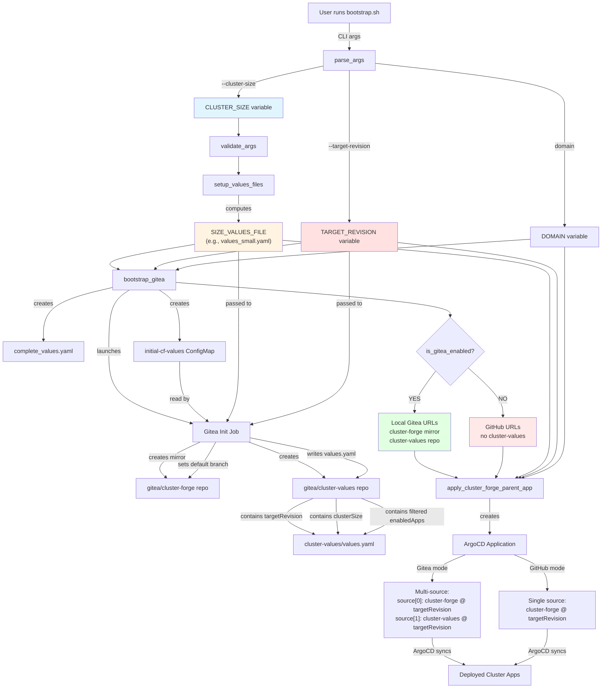

# Bootstrap Flow Analysis: Cluster Size, Target Revision, and Repo URLs

## Overview

This document traces how three critical configuration parameters flow through the bootstrap process:
1. **Cluster Size** (`--cluster-size`)
2. **Target Revision** (`--target-revision`)
3. **Repository URLs** (determined by Gitea enablement)

## Flow Diagram



## Detailed Flow Breakdown

### 1. Initial Argument Parsing

**Location:** `parse_args()` function (lines 245-387)

```bash
# Defaults
CLUSTER_SIZE="medium"              # Default to medium
TARGET_REVISION="$LATEST_RELEASE"  # v2.0.2
VALUES_FILE="values.yaml"

# CLI parsing examples:
# --cluster-size=small  → CLUSTER_SIZE="small"
# -r v2.1.0            → TARGET_REVISION="v2.1.0"
# example.com          → DOMAIN="example.com"
```

### 2. Values File Setup

**Location:** `setup_values_files()` function (lines 438-448)

```bash
SIZE_VALUES_FILE="values_${CLUSTER_SIZE}.yaml"
# Examples:
# - CLUSTER_SIZE="small"  → SIZE_VALUES_FILE="values_small.yaml"
# - CLUSTER_SIZE="medium" → SIZE_VALUES_FILE="values_medium.yaml"
# - CLUSTER_SIZE="large"  → SIZE_VALUES_FILE="values_large.yaml"
```

### 3. Gitea Bootstrap Phase

**Location:** `bootstrap_gitea()` function (lines 560-755)

#### 3.1 Complete Values Creation

```bash
# Create complete_values.yaml from base values
cp "${SOURCE_ROOT}/root/${VALUES_FILE}" "${TEMP_DIR}/complete_values.yaml"

# Fill in key placeholders
yq eval ".global.domain = \"${DOMAIN}\"" -i "${TEMP_DIR}/complete_values.yaml"
yq eval ".global.clusterSize = \"${SIZE_VALUES_FILE}\"" -i "${TEMP_DIR}/complete_values.yaml"
yq eval ".clusterForge.targetRevision = \"${TARGET_REVISION}\"" -i "${TEMP_DIR}/complete_values.yaml"

# Merge with size-specific values
yq eval-all 'select(fileIndex == 0) * select(fileIndex == 1)' \
  "${TEMP_DIR}/complete_values.yaml" \
  "${SOURCE_ROOT}/root/${SIZE_VALUES_FILE}" > merged.yaml
```

**Result:** `complete_values.yaml` contains:
```yaml
global:
  domain: "example.com"
  clusterSize: "values_small.yaml"

clusterForge:
  targetRevision: "v2.0.2"

enabledApps:
  - argocd
  - gitea
  - keycloak
  # ... (merged from base + size-specific)
```

#### 3.2 ConfigMap Creation

```bash
kubectl create configmap initial-cf-values \
  --from-literal=initial-cf-values="$(cat "${TEMP_DIR}/complete_values.yaml")" \
  -n cf-gitea
```

**Purpose:** The gitea-init-job reads this configmap to get the complete merged configuration.

#### 3.3 Gitea Init Job Invocation

```bash
helm template --release-name gitea-init ${SOURCE_ROOT}/scripts/init-gitea-job \
  --set clusterSize="${SIZE_VALUES_FILE:-values_${CLUSTER_SIZE}.yaml}" \
  --set domain="${DOMAIN}" \
  --set targetRevision="${TARGET_REVISION}" \
  --values "${temp_values_file}"  # contains disabledApps if set
```

**Templated Values in init-gitea job:**
```yaml
# From cf-init-gitea-cm.yaml line 105
targetRevision: {{ .Values.targetRevision }}  # e.g., "v2.0.2"

# From cf-init-gitea-cm.yaml line 112
global:
  clusterSize: {{ .Values.clusterSize }}      # e.g., "values_small.yaml"
  domain: DOMAIN_PLACEHOLDER

# From line 102: Sets mirror default branch if non-main
"default_branch": "{{ .Values.targetRevision }}"
```

### 4. Gitea Init Job Execution

**Location:** `scripts/init-gitea-job/templates/cf-init-gitea-cm.yaml`

#### 4.1 Mirror Creation (lines 47-96)

```bash
# Creates mirror of silogen/cluster-forge in Gitea
curl -X POST "${GITEA_URL}/api/v1/repos/migrate" \
  -d '{
    "clone_addr": "https://github.com/silogen/cluster-forge.git",
    "repo_name": "cluster-forge",
    "service": "git",
    "mirror": true,
    "mirror_interval": "15m"
  }'

# Set default branch to TARGET_REVISION if not "main"
if [ "{{ .Values.targetRevision }}" != "main" ]; then
  curl -X PATCH "${GITEA_URL}/api/v1/repos/cluster-org/cluster-forge" \
    -d '{"default_branch": "{{ .Values.targetRevision }}"}'
fi
```

**Purpose:** Creates a local mirror of cluster-forge pointing to the specified target revision.

#### 4.2 Cluster-Values Repo Creation (lines 107-200)

```bash
# Create cluster-values repo structure
cat > /tmp/values.yaml << 'EOF'
clusterForge:
  repoURL: http://gitea-http.cf-gitea.svc:3000/cluster-org/cluster-forge.git
  path: root
  targetRevision: {{ .Values.targetRevision }}

global:
  clusterSize: {{ .Values.clusterSize }}
  domain: DOMAIN_PLACEHOLDER

enabledApps:
EOF

# Process enabledApps from complete_values.yaml
yq eval '.enabledApps[]' /tmp/complete_values.yaml | while read -r app; do
  # Check if app matches any disabled pattern
  if [ "$disabled" = "true" ]; then
    echo "  #- $app    # Disabled by --disabled-apps" >> /tmp/values.yaml
  else
    echo "  - $app" >> /tmp/values.yaml
  fi
done
```

**Result:** Creates `values.yaml` in cluster-values repo containing:
```yaml
clusterForge:
  repoURL: http://gitea-http.cf-gitea.svc:3000/cluster-org/cluster-forge.git
  path: root
  targetRevision: v2.0.2

global:
  clusterSize: values_small.yaml
  domain: example.com

enabledApps:
  - argocd
  - gitea
  - keycloak
  #- airm     # Disabled by --disabled-apps
```

### 5. Repository URL Determination

**Location:** Multiple functions use `is_gitea_enabled()`

#### 5.1 Detection Logic (lines 536-552)

```bash
is_gitea_enabled() {
  local values_file="${SOURCE_ROOT}/root/${VALUES_FILE}"
  local size_values_file="${SOURCE_ROOT}/root/${SIZE_VALUES_FILE}"
  
  # Check base values file
  if yq eval '.enabledApps[] | select(. == "gitea")' "$values_file" | grep -q "gitea"; then
    return 0
  fi
  
  # Check size-specific values file if it exists
  if [ -n "${SIZE_VALUES_FILE}" ] && [ -f "$size_values_file" ]; then
    if yq eval '.enabledApps[] | select(. == "gitea")' "$size_values_file" | grep -q "gitea"; then
      return 0
    fi
  fi
  
  return 1
}
```

#### 5.2 URL Assignment Pattern

**Used in:** `apply_cluster_forge_parent_app()` (lines 830-835), `render_cluster_forge_child_apps()` (lines 804-809)

```bash
# Determine repo URLs based on whether gitea is enabled
local cluster_forge_repo="http://gitea-http.cf-gitea.svc:3000/cluster-org/cluster-forge.git"
local external_values_repo="http://gitea-http.cf-gitea.svc:3000/cluster-org/cluster-values.git"
local external_values_enabled="true"

if ! is_gitea_enabled; then
  cluster_forge_repo="https://github.com/silogen/cluster-forge.git"
  external_values_enabled="false"
fi
```

### 6. ClusterForge Parent App Creation

**Location:** `apply_cluster_forge_parent_app()` function (lines 824-858)

```bash
helm template cluster-forge "${SOURCE_ROOT}/root" \
    --show-only templates/cluster-forge.yaml \
    --values "${SOURCE_ROOT}/root/${VALUES_FILE}" \
    --values "${SOURCE_ROOT}/root/${SIZE_VALUES_FILE}" \
    --set global.clusterSize="${SIZE_VALUES_FILE}" \
    --set global.domain="${DOMAIN}" \
    --set clusterForge.repoUrl="${cluster_forge_repo}" \
    --set clusterForge.targetRevision="${TARGET_REVISION}" \
    --set clusterForge.valuesFile="${VALUES_FILE}" \
    --set externalValues.enabled="${external_values_enabled}" \
    --set externalValues.repoUrl="${external_values_repo}"
```

### 7. ArgoCD Application Template

**Location:** `root/templates/cluster-forge.yaml`

#### 7.1 Gitea Enabled (Multi-Source)

```yaml
sources:
  # Chart source from cluster-forge repo
  - repoURL: http://gitea-http.cf-gitea.svc:3000/cluster-org/cluster-forge.git
    targetRevision: "v2.0.2"  # {{ .Values.clusterForge.targetRevision }}
    path: root
    helm:
      valueFiles:
        - {{ .Values.externalValues.path }}           # default path
        - {{ .Values.global.clusterSize }}            # values_small.yaml
        - $cluster-values/values.yaml                 # from cluster-values repo
  
  # Values source from cluster-values repo
  - repoURL: http://gitea-http.cf-gitea.svc:3000/cluster-org/cluster-values.git
    targetRevision: {{ .Values.externalValues.targetRevision }}
    ref: cluster-values
```

**How it works:**
1. **Source 0** (cluster-forge): Templates come from `root/` at `targetRevision`
2. **Source 1** (cluster-values): Provides `values.yaml` which overrides with cluster-specific config
3. **Value merge order:** 
   - `values.yaml` (base from cluster-forge)
   - `values_small.yaml` (size-specific from cluster-forge)
   - `values.yaml` (from cluster-values repo - overrides all)

#### 7.2 Gitea Disabled (Single Source)

```yaml
source:
  repoURL: https://github.com/silogen/cluster-forge.git
  targetRevision: "v2.0.2"  # {{ .Values.clusterForge.targetRevision }}
  path: root
  helm:
    valueFiles:
      - {{ .Values.clusterForge.valuesFile }}     # values.yaml
      - {{ .Values.global.clusterSize }}          # values_small.yaml
```

**How it works:**
1. All content (templates + values) from GitHub
2. **Value merge order:**
   - `values.yaml` (base)
   - `values_small.yaml` (size-specific override)

## Key Decision Points

### When is Gitea Used?

| Condition | cluster-forge repo | cluster-values repo | Multi-source? |
|-----------|-------------------|---------------------|---------------|
| `gitea` in `enabledApps` | Gitea mirror | Gitea repo | ✅ Yes |
| `gitea` NOT in `enabledApps` | GitHub | N/A | ❌ No |

### How Target Revision Flows

```
CLI --target-revision=v2.0.2
  ↓
bootstrap_gitea() sets in complete_values.yaml
  ↓
gitea-init-job receives as helm value
  ↓
Creates cluster-values/values.yaml with clusterForge.targetRevision: v2.0.2
  ↓
apply_cluster_forge_parent_app() sets in ArgoCD Application
  ↓
ArgoCD syncs from cluster-forge repo @ v2.0.2
```

### How Cluster Size Flows

```
CLI --cluster-size=small
  ↓
setup_values_files() computes SIZE_VALUES_FILE=values_small.yaml
  ↓
bootstrap_gitea() merges values.yaml + values_small.yaml
  ↓
gitea-init-job creates cluster-values/values.yaml with global.clusterSize: values_small.yaml
  ↓
apply_cluster_forge_parent_app() sets in ArgoCD Application
  ↓
ArgoCD uses values_small.yaml as valueFile for resource sizing
```

## Configuration Points Summary

| Parameter | CLI Default | Sets Variable | Used In | Final Destination |
|-----------|-------------|---------------|---------|-------------------|
| `--cluster-size` | `medium` | `CLUSTER_SIZE` → `SIZE_VALUES_FILE` | `bootstrap_gitea`, `apply_cluster_forge_parent_app` | ArgoCD `valueFiles`, Gitea `values.yaml` |
| `--target-revision` | `v2.0.2` | `TARGET_REVISION` | `bootstrap_gitea`, `apply_cluster_forge_parent_app` | ArgoCD `targetRevision`, Gitea mirror branch, `values.yaml` |
| `domain` (positional) | *(required)* | `DOMAIN` | All bootstrap functions | ArgoCD app configs, Gitea `values.yaml` |
| `--disabled-apps` | *(none)* | `DISABLED_APPS` | `bootstrap_gitea` (gitea-init-job) | Commented in Gitea `values.yaml` |

## Important Notes

### 1. Gitea Init Job is Critical

The gitea-init-job is responsible for:
- Creating the local Gitea mirror of cluster-forge
- Setting the default branch to `TARGET_REVISION` (if not "main")
- Creating cluster-values repo
- Processing disabled apps and filtering `enabledApps`
- Writing the final `values.yaml` that ArgoCD will use

### 2. Value Override Hierarchy

When Gitea is enabled:
```
root/values.yaml (base)
  ← root/values_small.yaml (size-specific)
  ← cluster-values/values.yaml (cluster-specific, includes filtered enabledApps)
```

The cluster-values repo is the **final source of truth** for ArgoCD.

### 3. targetRevision Usage

The `targetRevision` parameter serves dual purposes:
1. **ArgoCD sync target:** Which git ref to sync from (tag/branch/commit)
2. **Gitea mirror default branch:** Sets the default branch for the mirrored repo

### 4. Disabled Apps Handling

Disabled apps (via `--disabled-apps`) are:
- **NOT removed** from the bootstrap script's values
- **Commented out** in the cluster-values repo by gitea-init-job
- **Never deployed** by ArgoCD because they're commented in the final values.yaml

Example:
```yaml
# In cluster-values/values.yaml
enabledApps:
  - argocd
  - gitea
  #- airm                    # Disabled by --disabled-apps
  - keycloak
```

### 5. Repository URL Detection

The bootstrap script automatically detects whether to use:
- **Local Gitea repos** (when `gitea` is in `enabledApps`)
- **GitHub repos** (when `gitea` is NOT in `enabledApps`)

This allows for:
- Air-gapped deployments (local Gitea)
- Direct-from-GitHub deployments (no Gitea)

## Troubleshooting Guide

### How to verify cluster size is applied?

```bash
# Check ArgoCD Application
kubectl get application cluster-forge -n argocd -o yaml | grep -A 5 valueFiles

# Expected output:
#       valueFiles:
#       - values.yaml
#       - values_small.yaml
#       - $cluster-values/values.yaml
```

### How to verify target revision?

```bash
# Check ArgoCD Application
kubectl get application cluster-forge -n argocd -o jsonpath='{.spec.sources[0].targetRevision}'

# Expected output: v2.0.2
```

### How to verify repo URLs?

```bash
# Check ArgoCD Application sources
kubectl get application cluster-forge -n argocd -o jsonpath='{.spec.sources[*].repoURL}'

# Expected output (Gitea enabled):
# http://gitea-http.cf-gitea.svc:3000/cluster-org/cluster-forge.git http://gitea-http.cf-gitea.svc:3000/cluster-org/cluster-values.git

# Expected output (Gitea disabled):
# https://github.com/silogen/cluster-forge.git
```

### How to verify cluster-values content?

```bash
# If Gitea is deployed, check the repo content via API
GITEA_URL="http://gitea.example.com"
GITEA_TOKEN=$(kubectl get secret gitea-admin-token -n cf-gitea -o jsonpath='{.data.token}' | base64 -d)

curl -H "Authorization: token $GITEA_TOKEN" \
  "${GITEA_URL}/api/v1/repos/cluster-org/cluster-values/contents/values.yaml" | \
  jq -r '.content' | base64 -d
```
