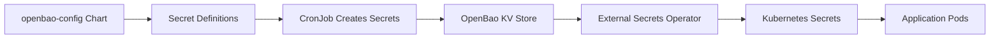
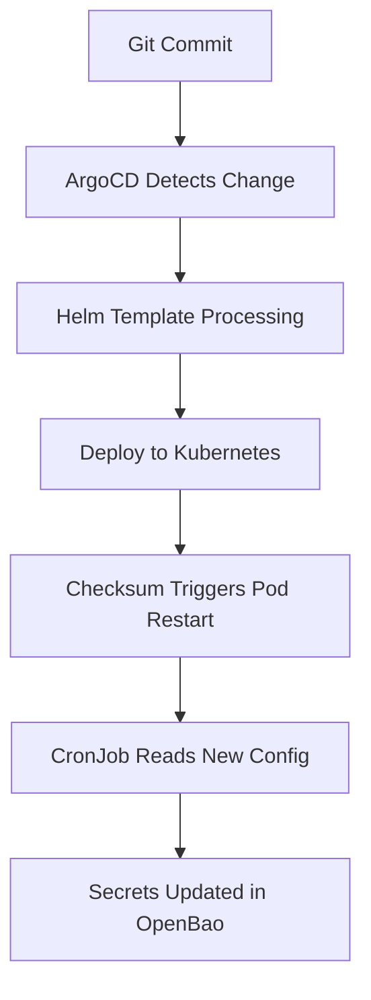

# OpenBao Config Helm Chart Technical Reference

This document provides technical documentation for the `openbao-config` Helm chart, which manages OpenBao configuration and automated secret management in cluster-forge.

## Chart Overview

### Basic Information

- **Chart Name**: `openbao-config`
- **Chart Version**: `0.1.0`
- **Location**: `sources/openbao-config/0.1.0/`
- **Deployment Method**: ArgoCD GitOps
- **Target Namespace**: `cf-openbao`

### Purpose

The `openbao-config` Helm chart provides:
1. **Declarative secret definitions** via ConfigMap
2. **Automated secret management** through CronJob
3. **OpenBao operational configuration** (unseal automation, HTTP routes)
4. **RBAC and security policies** for secret management

## Chart Structure

```
sources/openbao-config/
├── 0.1.0/                               # Chart version directory  
│   ├── Chart.yaml                       # Chart metadata
│   ├── values.yaml                      # Default values
│   └── templates/
│       ├── openbao-httproute.yaml           # HTTP routing configuration
│       ├── openbao-secret-definitions.yaml  # Secret definitions ConfigMap
│       ├── openbao-secret-manager-cronjob.yaml  # Automated management CronJob
│       ├── openbao-secret-manager-rbac.yaml     # RBAC for secret management
│       ├── openbao-unseal-cm.yaml           # Unseal script ConfigMap
│       ├── openbao-unseal-cronjob.yaml      # Unseal automation CronJob
│       └── openbao-unseal-rbac.yaml         # RBAC for unseal operations
├── source.yaml                          # App source definition (future)
└── values_cf.yaml                       # Common values file (future)
```

## Chart Configuration

### Chart.yaml

```yaml
apiVersion: v2
name: openbao-config
description: A Helm chart with config for OpenBao
version: 0.1.0
```

### values.yaml

```yaml
domain: # to be filled by cluster-forge app
```

**Notes:**
- Minimal values file with only domain parameter
- Domain value is injected by ArgoCD during deployment
- Additional values can be added for environment-specific configuration

## ArgoCD Integration

### Application Configuration (in root/values.yaml)

```yaml
openbao-config:
  path: openbao-config/0.1.0
  namespace: cf-openbao
  valuesFile: values.yaml
  helmParameters:
    - name: domain
      value: "{{ .Values.global.domain }}"
  syncWave: -2
```

### Key Integration Points

1. **Domain Injection**: Global domain passed via `helmParameters`
2. **Sync Wave**: `-2` ensures deployment after core OpenBao but before applications
3. **GitOps Management**: Changes to templates trigger automatic redeployment
4. **Values File**: Uses chart's local `values.yaml` for configuration

## Template Reference

### 1. openbao-secret-definitions.yaml

**Purpose**: Defines all secrets to be created in OpenBao

```yaml
apiVersion: v1
kind: ConfigMap
metadata:
  name: openbao-secrets-config
  namespace: cf-openbao
data:
  secrets.env: |
    # Secret definitions in format: SECRET_PATH|TYPE|VALUE|BYTES
    secrets/cluster-domain|static|{{ .Values.domain }}|0
    secrets/my-app-password|random||32
```

**Template Features:**
- **Domain Templating**: `{{ .Values.domain }}` replaced during deployment
- **Pipe-Delimited Format**: Easy parsing by management script
- **Comprehensive Documentation**: Inline comments and examples
- **Categorized Sections**: Logical grouping by application/service

### 2. openbao-secret-manager-cronjob.yaml

**Purpose**: Automates secret creation and management

```yaml
apiVersion: batch/v1
kind: CronJob
metadata:
  name: openbao-secret-manager
  namespace: cf-openbao
spec:
  schedule: "*/5 * * * *"  # Every 5 minutes
  concurrencyPolicy: Forbid
  jobTemplate:
    spec:
      template:
        metadata:
          annotations:
            configmap-checksum: {{ include (print $.Template.BasePath "/openbao-secret-definitions.yaml") . | sha256sum }}
        spec:
          serviceAccountName: openbao-secret-manager-sa
          containers:
          - name: secret-manager
            image: ghcr.io/silogen/cluster-tool:latest
            env:
            - name: BAO_ADDR
              value: http://openbao-internal:8200
            command: ["/bin/bash", "-c"]
            args:
              - |
                export BAO_TOKEN=$(kubectl get secret openbao-keys -n cf-openbao -o jsonpath='{.data.root_token}' | base64 -d)
                export DOMAIN="{{ .Values.domain }}"
                /tmp/scripts/manage-secrets.sh
            volumeMounts:
            - name: scripts
              mountPath: /tmp/scripts
            - name: secrets-config
              mountPath: /tmp/secrets
          volumes:
          - name: scripts
            configMap:
              name: openbao-secret-manager-scripts
          - name: secrets-config
            configMap:
              name: openbao-secrets-config
```

**Template Features:**
- **Checksum Annotations**: `{{ include ... | sha256sum }}` forces pod restart on config changes
- **Domain Injection**: `{{ .Values.domain }}` passed as environment variable
- **Security**: Uses dedicated ServiceAccount with minimal permissions
- **Resource Management**: Controlled CPU/memory limits
- **Idempotent**: Script only creates missing secrets

### 3. openbao-secret-manager-rbac.yaml

**Purpose**: Provides minimal RBAC for secret management operations

```yaml
apiVersion: v1
kind: ServiceAccount
metadata:
  name: openbao-secret-manager-sa
  namespace: cf-openbao
---
apiVersion: rbac.authorization.k8s.io/v1
kind: ClusterRole
metadata:
  name: openbao-secret-manager-role
rules:
- apiGroups: [""]
  resources: ["secrets"]
  verbs: ["get"]
  resourceNames: ["openbao-keys"]
- apiGroups: [""]
  resources: ["secrets"]
  verbs: ["get", "list"]
---
apiVersion: rbac.authorization.k8s.io/v1
kind: ClusterRoleBinding
metadata:
  name: openbao-secret-manager-binding
roleRef:
  apiGroup: rbac.authorization.k8s.io
  kind: ClusterRole
  name: openbao-secret-manager-role
subjects:
- kind: ServiceAccount
  name: openbao-secret-manager-sa
  namespace: cf-openbao
```

**Security Features:**
- **Minimal Permissions**: Only read access to required secrets
- **Resource-Specific**: Limited to `openbao-keys` secret by name
- **Namespace-Scoped**: ServiceAccount limited to cf-openbao namespace
- **Least Privilege**: No write permissions to Kubernetes resources

### 4. openbao-unseal-cronjob.yaml

**Purpose**: Automates OpenBao unsealing every 5 minutes

```yaml
apiVersion: batch/v1
kind: CronJob
metadata:
  name: openbao-unseal-job
  namespace: cf-openbao
spec:
  schedule: "*/5 * * * *"
  concurrencyPolicy: Forbid
  jobTemplate:
    spec:
      template:
        spec:
          serviceAccountName: openbao-unseal-job-sa
          containers:
          - name: openbao-init
            image: ghcr.io/silogen/cluster-tool:latest
            command: ["/bin/bash"]
            args: ["/tmp/scripts/unseal-openbao.sh"]
            env:
            - name: UNSEAL_KEY
              valueFrom:
                secretKeyRef:
                  name: openbao-keys
                  key: unseal_key
            volumeMounts:
            - name: scripts
              mountPath: /tmp/scripts
          volumes:
          - name: scripts
            configMap:
              name: openbao-unseal-scripts
              defaultMode: 0755
```

**Operational Features:**
- **High Availability**: Ensures OpenBao pods remain unsealed
- **Secret Integration**: Reads unseal key from openbao-keys secret
- **Concurrent Protection**: Forbids multiple unseal jobs running simultaneously
- **Script Volume**: Mounts unseal scripts with executable permissions

## Bootstrap Integration

### Multi-Stage Bootstrap Process

The chart integrates with the bootstrap process in multiple ways:

#### 1. Static ConfigMap Creation (Bootstrap Phase)

```bash
# Create static ConfigMaps needed for init job
helm template --release-name openbao-config-static ${SCRIPT_DIR}/init-openbao-job \
  --set domain="${DOMAIN}" --kube-version=${KUBE_VERSION} \
  --show-only templates/openbao-secret-manager-cm.yaml | kubectl apply -f -
```

#### 2. Initial Secret Config Deployment (Bootstrap Phase)

```bash
# Create initial secrets config for init job (separate from ArgoCD-managed version)
cat ${SCRIPT_DIR}/../sources/openbao-config/0.1.0/templates/openbao-secret-definitions.yaml | \
  sed "s|{{ .Values.domain }}|${DOMAIN}|g" | \
  sed "s|name: openbao-secrets-config|name: openbao-secrets-init-config|g" | kubectl apply -f -
```

#### 3. ArgoCD Application Deployment (Post-Bootstrap)

```bash
# Create cluster-forge app-of-apps (includes openbao-config)
helm template ${SCRIPT_DIR}/../root -f ${SCRIPT_DIR}/../root/${VALUES_FILE} \
  --set global.domain="${DOMAIN}" --kube-version=${KUBE_VERSION} | kubectl apply -f -
```

### Separation of Concerns

| Phase | Purpose | ConfigMap Name | Management |
|-------|---------|---------------|------------|
| **Bootstrap** | Initial secret creation | `openbao-secrets-init-config` | Manual (bootstrap script) |
| **Ongoing** | Ongoing secret management | `openbao-secrets-config` | GitOps (ArgoCD) |

This separation ensures:
- Bootstrap can create initial secrets without ArgoCD dependency
- ArgoCD manages ongoing configuration changes
- No conflicts between bootstrap and GitOps processes

## Templating and Values

### Domain Templating

**Static Secrets with Domain References:**
```bash
# In openbao-secret-definitions.yaml template
secrets/minio-openid-url|static|https://kc.{{ .Values.domain }}/realms/airm/.well-known/openid-configuration|0

# After Helm processing with domain=app.silogen.ai
secrets/minio-openid-url|static|https://kc.app.silogen.ai/realms/airm/.well-known/openid-configuration|0
```

**Environment Variable Injection:**
```yaml
# In CronJob template
env:
- name: DOMAIN
  value: "{{ .Values.domain }}"

# Results in runtime
DOMAIN=app.silogen.ai
```

### Checksum-Based Updates

**Template Function:**
```yaml
annotations:
  configmap-checksum: {{ include (print $.Template.BasePath "/openbao-secret-definitions.yaml") . | sha256sum }}
```

**Behavior:**
1. Helm calculates SHA256 hash of secret definitions template
2. Hash included as pod annotation
3. Configuration changes → new hash → pod restart → config reload

## Operational Considerations

### Deployment Timing

**Sync Waves (in order):**
- `-3`: Core OpenBao deployment
- `-2`: **openbao-config** (this chart)
- `-1`: Infrastructure applications
- `0`: User applications

### Resource Requirements

**CronJob Pods:**
```yaml
resources:
  requests:
    memory: "64Mi"
    cpu: "100m"
  limits:
    memory: "256Mi"
    cpu: "500m"
```

**Typical Resource Usage:**
- **Memory**: ~50-80Mi during execution
- **CPU**: Minimal, mostly I/O bound
- **Runtime**: 30-60 seconds per job
- **Frequency**: Every 5 minutes

### Monitoring and Observability

**CronJob Status:**
```bash
# Check CronJob health
kubectl get cronjob -n cf-openbao

# View recent job executions
kubectl get jobs -n cf-openbao -l job-name=openbao-secret-manager

# Check job logs
kubectl logs -l job-name=openbao-secret-manager -n cf-openbao --tail=50
```

**ArgoCD Sync Status:**
```bash
# Check application health
kubectl get application openbao-config -n argocd

# View sync details
argocd app get openbao-config
```

## Customization and Extension

### Adding New Templates

1. **Create new template file** in `templates/` directory
2. **Follow naming convention**: `openbao-{component}-{type}.yaml`
3. **Include appropriate metadata** and namespace
4. **Use consistent labeling** for resource organization
5. **Test with helm template** command before committing

### Environment-Specific Values

**Development Environment:**
```yaml
# values-dev.yaml
domain: dev.example.com
debug:
  enabled: true
  logLevel: debug
```

**Production Environment:**
```yaml
# values-prod.yaml  
domain: app.silogen.ai
monitoring:
  enabled: true
  alerting: true
```

### Advanced Configuration

**Custom Secret Sources:**
```yaml
# In values.yaml
secretSources:
  external:
    enabled: true
    configMap: external-secret-definitions
```

**Resource Tuning:**
```yaml
# In values.yaml
cronJob:
  resources:
    limits:
      memory: 512Mi
      cpu: 1000m
  schedule: "*/3 * * * *"  # More frequent execution
```

## Troubleshooting

### Common Issues

#### 1. Domain Templating Not Working

**Symptom**: Static secrets contain literal `{{ .Values.domain }}` instead of actual domain

**Cause**: Domain not properly injected by ArgoCD

**Solution**:
```bash
# Check ArgoCD application parameters
kubectl get application openbao-config -n argocd -o yaml | grep -A5 parameters

# Verify domain parameter is set
argocd app get openbao-config --show-params
```

#### 2. CronJob Not Creating Secrets

**Symptom**: Secrets defined but not appearing in OpenBao

**Debugging Steps**:
```bash
# 1. Check CronJob execution
kubectl get jobs -n cf-openbao -l job-name=openbao-secret-manager

# 2. Check job logs
JOB=$(kubectl get jobs -n cf-openbao -l job-name=openbao-secret-manager --sort-by=.metadata.creationTimestamp -o jsonpath='{.items[-1].metadata.name}')
kubectl logs job/$JOB -n cf-openbao

# 3. Verify ConfigMap content
kubectl get configmap openbao-secrets-config -n cf-openbao -o yaml

# 4. Test secret creation manually
kubectl exec -n cf-openbao openbao-0 -- bao kv put secrets/test-secret value=test
```

#### 3. RBAC Permission Errors

**Symptom**: CronJob fails with "forbidden" errors

**Solution**:
```bash
# Check ServiceAccount permissions
kubectl auth can-i get secrets --as=system:serviceaccount:cf-openbao:openbao-secret-manager-sa

# Verify ClusterRole binding
kubectl get clusterrolebinding openbao-secret-manager-binding -o yaml
```

#### 4. Checksum Annotation Issues

**Symptom**: Pods not restarting when configuration changes

**Debugging**:
```bash
# Check current checksum annotation
kubectl get pod -n cf-openbao -l job-name=openbao-secret-manager -o jsonpath='{.items[0].metadata.annotations.configmap-checksum}'

# Force new job run
kubectl create job manual-secret-sync --from=cronjob/openbao-secret-manager -n cf-openbao
```

## Best Practices

### 1. Chart Development
- **Use consistent naming**: Follow `openbao-{component}-{type}.yaml` pattern
- **Include proper metadata**: Labels, annotations, and descriptions
- **Implement health checks**: Where applicable for deployed resources
- **Document template functions**: Complex Helm functions should be commented

### 2. Configuration Management
- **Test changes locally**: Use `helm template` before committing
- **Use meaningful commit messages**: For GitOps traceability  
- **Group related changes**: Batch related secret additions in single commits
- **Validate syntax**: Check YAML validity and Helm template rendering

### 3. Security
- **Minimal RBAC**: Grant only necessary permissions
- **Resource limits**: Set appropriate CPU/memory constraints
- **Secret rotation**: Plan for eventual secret rotation capabilities
- **Audit trail**: Maintain GitOps commit history for changes

### 4. Operations
- **Monitor CronJob health**: Set up alerting for job failures
- **Regular log review**: Check for unusual patterns or errors
- **Backup configurations**: Ensure secret definitions are backed up
- **Documentation**: Keep this documentation updated with changes

## Integration with External Systems

### External Secrets Operator

The chart provides secrets that are consumed by External Secrets Operator:



### ArgoCD GitOps Integration



This technical reference provides comprehensive documentation for developers and operators working with the `openbao-config` Helm chart.