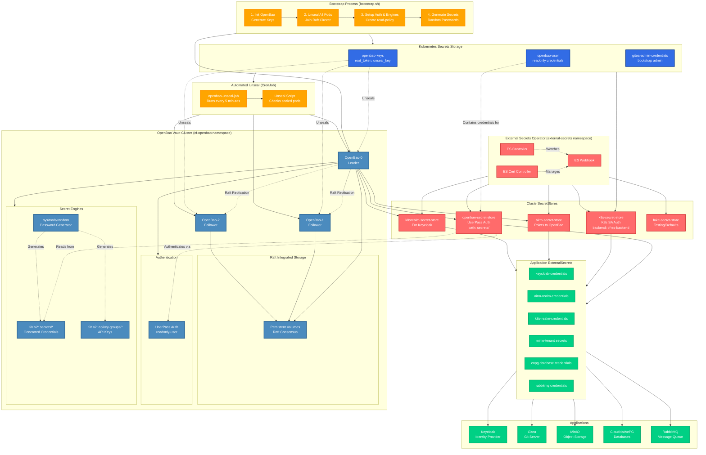

# Secrets Management Architecture

## Overview

This document describes the comprehensive secrets management architecture used in cluster-forge. The system is built around OpenBao (open-source Vault fork) as the central secrets vault, with External Secrets Operator enabling seamless integration with Kubernetes workloads.

## Architecture Diagram



## Key Components

### 1. OpenBao Vault Cluster

**Deployment Model:**
- 3-node cluster in High Availability (HA) mode
- Raft integrated storage (no external dependencies)
- Each pod runs in `cf-openbao` namespace
- Auto-unseal via CronJob every 5 minutes

**Configuration:**
```yaml
Storage: Raft integrated
UI: Enabled
Auth Methods: userpass
Secret Engines: 
  - secrets/ (KV v2) - Application secrets
  - apikey-groups/ (KV v2) - API key management
  - sys/tools/random - Password generation
```

### 2. Bootstrap Process

**init-openbao.sh:**
1. Checks if OpenBao is already initialized
2. Initializes with key-shares=1, key-threshold=1 (single key setup)
3. Stores `root_token` and `unseal_key` in K8s secret `openbao-keys`
4. Unseals all 3 pods
5. Forms Raft cluster (pods join via HTTP)

**setup-openbao.sh:**
1. Enables KV v2 engines at `secrets/` and `apikey-groups/`
2. Enables `userpass` authentication
3. Creates `read-policy` for read-only access
4. Creates `readonly-user` with read-only permissions
5. Stores readonly credentials in K8s secret `openbao-user`

**generate-secrets.sh:**
Generates all application secrets using OpenBao's random generator:
- Database credentials (Keycloak, AIRM, Catalog)
- RabbitMQ user credentials
- MinIO access keys and secrets
- OAuth client secrets (Gitea, ArgoCD, K8s realm)
- Keycloak admin passwords
- Cluster authentication tokens

### 3. Automated Unseal Mechanism

**CronJob Configuration:**
- Schedule: Every 5 minutes (`*/5 * * * *`)
- Runs in `cf-openbao` namespace
- Service Account: `openbao-unseal-job-sa`
- Permissions: Get pods, exec into pods, read secrets

**Unseal Logic:**
1. Retrieves `unseal_key` from `openbao-keys` secret
2. Finds all running OpenBao pods that are sealed
3. Executes `bao operator unseal` on each sealed pod
4. Handles pod restarts and cluster member changes

### 4. External Secrets Operator

**Components:**
- **Controller**: Watches ExternalSecret resources and syncs from backends
- **Webhook**: Validates ExternalSecret/SecretStore resources
- **Cert Controller**: Manages TLS certificates for webhooks

**ClusterSecretStore Types:**

1. **openbao-secret-store**
   - Provider: OpenBao (vault)
   - Auth: UserPass (readonly-user)
   - Path: secrets/
   - Used by: Most application secrets

2. **k8s-secret-store**
   - Provider: Kubernetes
   - Auth: Service Account (external-secrets-readonly)
   - Backend: cf-es-backend namespace
   - Used by: Cross-namespace secret sharing

3. **airm-secret-store** / **k8srealm-secret-store**
   - Domain-specific stores for AIRM and K8s realm
   - Point to OpenBao with specific paths

4. **fake-secret-store**
   - Provider: Fake (hardcoded values)
   - Used for: Testing and default values

### 5. Secret Flow Architecture

```
┌─────────────────┐
│ Bootstrap Script│
└────────┬────────┘
         │ 1. Initialize
         ▼
┌─────────────────┐
│  OpenBao Vault  │◄─── Unseals every 5min
│   (3 replicas)  │
└────────┬────────┘
         │ 2. Store secrets
         ▼
┌─────────────────┐
│ KV v2 Engine    │
│  secrets/*      │
└────────┬────────┘
         │ 3. External Secrets reads
         ▼
┌──────────────────────┐
│ ClusterSecretStore   │
│ (openbao-secret-store)│
└────────┬─────────────┘
         │ 4. Sync to K8s
         ▼
┌─────────────────┐
│ ExternalSecret  │
│   Resources     │
└────────┬────────┘
         │ 5. Creates K8s Secret
         ▼
┌─────────────────┐
│ Application Pod │
│ (mounts secret) │
└─────────────────┘
```

### 6. Secret Categories

**Identity & Authentication:**
- Keycloak admin password
- OAuth client secrets (Gitea, ArgoCD, AIRM UI)
- Realm credentials (AIRM, K8s)

**Database Credentials:**
- PostgreSQL superuser & user credentials (AIRM, Keycloak, Catalog)
- Generated via OpenBao random tool
- Managed by CloudNativePG operator

**Storage & Messaging:**
- MinIO root password, API keys, console keys
- MinIO OpenID Connect URLs
- RabbitMQ user credentials

**Cluster Infrastructure:**
- Cluster admin tokens
- OpenBao root token (stored in K8s)
- Domain configuration

### 7. Security Model

**Encryption at Rest:**
- OpenBao data encrypted in Raft storage
- Kubernetes secrets encrypted if cluster encryption is enabled

**Access Control:**
- **Root Token**: Stored in K8s secret, used only during bootstrap
- **Readonly User**: Limited to read operations on secrets path
- **Service Accounts**: Scoped to specific namespaces

**Network Security:**
- OpenBao accessible only within cluster (ClusterIP)
- TLS disabled for internal communication (cluster-internal)
- External Secrets uses internal service DNS

**Secret Rotation:**
- OpenBao supports secret versioning (KV v2)
- Applications can reference specific versions
- Old versions retained for rollback

### 8. Disaster Recovery

**Backup Strategy:**
- OpenBao unseal key stored in `openbao-keys` K8s secret
- Root token stored in `openbao-keys` K8s secret
- Raft storage on persistent volumes

**Recovery Process:**
1. Restore persistent volumes with Raft data
2. Deploy OpenBao pods
3. Unseal using stored unseal key
4. Verify cluster health via `bao operator raft list-peers`

**Important Notes:**
- Single unseal key (key-shares=1) - simplified but less secure
- For production, use Shamir's Secret Sharing (key-shares=5, threshold=3)
- Consider auto-unseal with cloud KMS for production

### 9. Integration Points

**Gitea Configuration:**
- Admin credentials generated during bootstrap
- OAuth client secret from OpenBao
- Integrated with Keycloak via OIDC

**Keycloak Realms:**
- Two realms: `airm` and `k8s`
- Client secrets managed in OpenBao
- Realm templates with placeholder substitution

**CloudNativePG:**
- Superuser and application user credentials
- Secrets created before cluster bootstrap
- Automatic database initialization

**MinIO Tenant:**
- Console and API credentials separate
- OIDC integration with Keycloak
- Auto-configured with OpenBao secrets

## Monitoring & Observability

**Health Checks:**
- OpenBao: `bao status` via exec probe
- External Secrets: Controller logs and metrics
- Secret Sync: ExternalSecret CR status conditions

**Common Issues:**
- **Sealed Vault**: Check CronJob execution and unseal key
- **Secret Sync Failure**: Verify ClusterSecretStore authentication
- **Missing Secrets**: Check OpenBao path and ExternalSecret remoteRef

## Best Practices

1. **Never commit unseal keys or root tokens** to version control
2. **Rotate readonly user credentials** periodically
3. **Monitor ExternalSecret sync errors** for failed secret updates
4. **Use specific secret versions** in production for stability
5. **Test secret rotation** in staging before production
6. **Backup `openbao-keys` secret** to secure external location
7. **Enable audit logging** in OpenBao for compliance
8. **Use namespaced SecretStores** for tenant isolation when possible

## Future Enhancements

- [ ] Implement auto-unseal with cloud KMS
- [ ] Add secret rotation automation
- [ ] Enable OpenBao audit logging
- [ ] Implement Shamir's Secret Sharing (N-of-M keys)
- [ ] Add monitoring/alerting for unsealed state
- [ ] Integrate with cert-manager for TLS
- [ ] Add RBAC policies for fine-grained access
- [ ] Implement secret versioning strategy
