# Cluster-Forge Dependency Map
## From cluster-bloom Prerequisites to AIRM Platform

### Visual Dependency Flow

```mermaid
flowchart TD
    %% Prerequisites (Top)
    subgraph PREREQ["🔧 Prerequisites"]
        direction TB
        CB_SC["cluster-bloom:<br/>Storage Class"]
        CB_DN["cluster-bloom:<br/>Domain Name"] 
        CB_TLS["cluster-bloom:<br/>cluster-tls Secret"]
        TOOLS["Tools: kubectl, helm, openssl"]
    end
    
    %% Bootstrap Foundation
    subgraph BOOTSTRAP["⚡ Layer 1: Bootstrap Foundation"]
        direction TB
        CF_ARGO["ArgoCD<br/>(GitOps Controller)"]
        CF_GITEA["Gitea<br/>(Git Repository)"]
        CF_VAULT["OpenBao<br/>(Secret Management)"]
    end
    
    %% Core Infrastructure Layer
    subgraph INFRA["🏗️ Layer 2: Core Infrastructure"]
        direction TB
        subgraph NET["Networking"]
            I_GWAPI["Gateway API"]
            I_KGWAY["KGateway"]
            I_CERT["cert-manager"]
            I_MLB["MetalLB"]
        end
        subgraph SEC["Security"]
            I_EXTSEC["external-secrets"]
            I_KYV["Kyverno"]
        end
        subgraph STOR["Storage"]
            I_CNPG["CNPG Operator"]
            I_MINIO_OP["MinIO Operator"]
        end
    end
    
    %% AI/ML Compute Layer  
    subgraph AIML["🤖 Layer 3: AI/ML Stack"]
        direction TB
        subgraph COMPUTE["Compute"]
            A_GPU["AMD GPU Operator"]
            A_RAY["KubeRay Operator"] 
            A_SERVE["KServe + CRDs"]
        end
        subgraph SCHEDULE["Scheduling"]
            A_KUEUE["Kueue"]
            A_APPW["AppWrapper"]
        end
        subgraph WORKFLOW["Workflow"]
            A_KAIWO["Kaiwo + CRDs"]
            A_RABBIT["RabbitMQ"]
        end
    end
    
    %% Observability Layer
    subgraph OBS["📊 Layer 4: Observability"]
        direction TB
        O_PROM["Prometheus CRDs"]
        O_OTEL["OpenTelemetry Operator"]
        O_LGTM["OTEL-LGTM Stack"]
    end
    
    %% Identity Layer
    subgraph IDENTITY["🔐 Layer 5: Identity & Access"]
        direction TB
        ID_KC["Keycloak"]
        ID_AUTH["cluster-auth"]
    end
    
    %% Final Deliverable
    subgraph AIRM["🎯 AIRM Platform (Main Deliverable)"]
        direction TB
        AIRM_UI["AIRM Frontend<br/>(Web Dashboard)"]
        AIRM_API["AIRM Backend<br/>(REST API)"] 
        AIRM_DISP["AIRM Dispatcher<br/>(Job Scheduler)"]
    end
    
    %% Top-Down Dependencies
    PREREQ --> BOOTSTRAP
    CB_SC --> CF_ARGO
    CB_DN --> CF_ARGO  
    CB_TLS --> I_KGWAY
    TOOLS --> CF_ARGO
    
    BOOTSTRAP --> INFRA
    CF_ARGO --> I_GWAPI
    CF_ARGO --> I_CERT
    CF_ARGO --> I_MLB
    CF_ARGO --> I_CNPG
    CF_ARGO --> I_MINIO_OP
    CF_VAULT --> I_EXTSEC
    
    INFRA --> AIML
    I_CNPG --> A_RABBIT
    I_MINIO_OP --> A_RABBIT
    CF_ARGO --> A_GPU
    CF_ARGO --> A_RAY
    CF_ARGO --> A_SERVE
    CF_ARGO --> A_KUEUE
    CF_ARGO --> A_KAIWO
    
    INFRA --> OBS
    CF_ARGO --> O_PROM
    CF_ARGO --> O_OTEL
    O_PROM --> O_LGTM
    O_OTEL --> O_LGTM
    
    INFRA --> IDENTITY
    CF_ARGO --> ID_KC
    CF_ARGO --> ID_AUTH
    
    %% All Layers Converge to AIRM
    BOOTSTRAP --> AIRM
    INFRA --> AIRM
    AIML --> AIRM
    OBS --> AIRM
    IDENTITY --> AIRM
    
    %% Critical AIRM Dependencies
    I_CNPG --> AIRM_API
    A_RABBIT --> AIRM_API
    A_RABBIT --> AIRM_DISP
    I_MINIO_OP --> AIRM_API
    ID_KC --> AIRM_API
    ID_KC --> AIRM_UI
    CF_VAULT --> AIRM_API
    I_EXTSEC --> AIRM_API
    I_KGWAY --> AIRM_UI
    I_KGWAY --> AIRM_API
    I_CERT --> AIRM_UI
    O_LGTM --> AIRM_API
    
    %% AI/ML to AIRM
    A_GPU --> AIRM_DISP
    A_RAY --> AIRM_DISP
    A_SERVE --> AIRM_DISP
    A_KUEUE --> AIRM_DISP
    A_APPW --> AIRM_DISP
    A_KAIWO --> AIRM_DISP
    I_KYV --> AIRM_DISP
    ID_AUTH --> AIRM_DISP
    
    %% Styling for better readability
    classDef prereqStyle fill:#fff2cc,stroke:#d6b656,stroke-width:2px,color:#000000
    classDef bootstrapStyle fill:#d5e8d4,stroke:#82b366,stroke-width:2px,color:#000000
    classDef infraStyle fill:#dae8fc,stroke:#6c8ebf,stroke-width:2px,color:#000000
    classDef aimlStyle fill:#ffe6cc,stroke:#d79b00,stroke-width:2px,color:#000000
    classDef obsStyle fill:#f8cecc,stroke:#b85450,stroke-width:2px,color:#000000
    classDef identityStyle fill:#e1d5e7,stroke:#9673a6,stroke-width:2px,color:#000000
    classDef airmStyle fill:#ff9999,stroke:#cc0000,stroke-width:4px,color:#000000
    
    class PREREQ prereqStyle
    class BOOTSTRAP bootstrapStyle
    class INFRA infraStyle
    class AIML aimlStyle
    class OBS obsStyle
    class IDENTITY identityStyle
    class AIRM airmStyle
```



### Critical Dependency Paths

#### 🔴 **Critical Path 1: Data & Storage**
```
cluster-bloom Storage Class → CNPG Operator → PostgreSQL Database → AIRM Backend
cluster-bloom Storage Class → MinIO Operator → MinIO Tenant → AIRM Backend
```

#### 🔴 **Critical Path 2: Networking & Access**
```
cluster-bloom Domain + TLS → KGateway → AIRM Frontend/API Access
cert-manager → TLS Certificates → AIRM HTTPS Access
```

#### 🔴 **Critical Path 3: Authentication**
```
OpenBao → External Secrets → AIRM Credentials
Keycloak → AIRM User Authentication
```

#### 🔴 **Critical Path 4: Messaging & Jobs**
```
RabbitMQ → AIRM Dispatcher → AI/ML Job Scheduling
Kueue + AI/ML Operators → AIRM Job Execution
```

### Component Categories by AIRM Dependency

#### 🚨 **Hard Dependencies** (AIRM breaks without these)
- **Storage**: CNPG Operator, MinIO Operator/Tenant  
- **Networking**: Gateway API, KGateway, cert-manager
- **Security**: OpenBao, external-secrets, Keycloak
- **Messaging**: RabbitMQ
- **Foundation**: ArgoCD, Gitea

#### ⚡ **AI/ML Dependencies** (Reduced functionality without these)
- **Compute**: AMD GPU Operator, KubeRay Operator
- **Serving**: KServe + CRDs
- **Scheduling**: Kueue, AppWrapper
- **Workflows**: Kaiwo + CRDs
- **Policies**: Kyverno, cluster-auth

#### 📊 **Observability Dependencies** (Monitoring/debugging impacted)
- **Metrics**: Prometheus CRDs, OTEL-LGTM Stack
- **Telemetry**: OpenTelemetry Operator

#### 🔧 **Infrastructure Dependencies** (Platform functionality)
- **Load Balancing**: MetalLB
- **GitOps**: ArgoCD Applications for all components

### Deployment Order Summary

1. **Prerequisites**: cluster-bloom outputs must exist
2. **Bootstrap**: ArgoCD → Gitea → OpenBao  
3. **Infrastructure**: Operators for storage, networking, security
4. **AI/ML Stack**: GPU, compute, workflow operators
5. **AIRM Application**: Frontend, Backend, Dispatcher

### Failure Impact Analysis

| Missing Component | AIRM Impact |
|------------------|-------------|
| PostgreSQL (CNPG) | ❌ Complete failure - no database |
| RabbitMQ | ❌ No job scheduling/dispatch |
| MinIO | ❌ No data/model storage |
| Keycloak | ❌ No user authentication |
| KGateway | ❌ No external access |
| GPU Operators | ⚠️ No GPU workloads |
| KServe | ⚠️ No model serving |
| Monitoring Stack | ⚠️ No observability |